# 🅿️ Automatic Parking Occupancy Estimation using Classical Image Processing

> A complete, end-to-end parking-lot occupancy estimation system built **entirely from classical computer-vision techniques** — homography, CLAHE, Otsu/adaptive thresholding, morphology, Canny/Sobel features and a transparent rule-based decision cascade. **No machine learning, no deep learning, no pretrained models.**

<p align="center">
  
  
  
  
</p>

<p align="center">
  
  
  
  
  
  
  
  
</p>

<!--
  DYNAMIC BADGES — paste these in once the project is pushed to GitHub and
  replace <user>/<repo> with the real path. They cannot render until then.

  
  
  
-->

---

## 🖼️ The System at a Glance

A **real, generated output** — the final annotated bird's-eye view for a sunny frame. Green = predicted **VACANT**, red = predicted **OCCUPIED**, and the banner shows live lot statistics. No stock art, no mockup: this is what the pipeline actually produces.

<p align="center">
  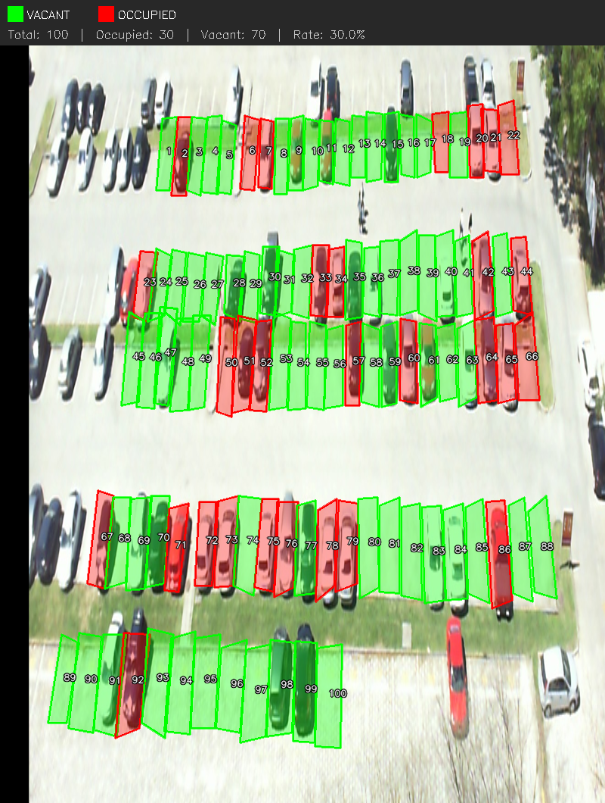
</p>

---

## 📖 Project Description

### The problem being solved

Drivers circling a full car park looking for a free space waste fuel, time and road capacity. Most commercial solutions solve this with **per-space hardware** — an ultrasonic or magnetometer sensor embedded in every single bay. For a 100-space lot that means 100 sensors to install, power, network and maintain.

This project solves the same problem with **one camera and no sensors**. It takes a single surveillance frame of a parking lot and answers three questions:

1. **How many spaces are there?** (`N` — read from the calibrated slot layout)
2. **Which specific spaces are occupied and which are free?** (a per-slot `OCCUPIED`/`VACANT` label)
3. **What is the overall occupancy rate?** (`O% = N_occupied / N × 100`)

### Why it matters

| Dimension | Impact |
|-----------|--------|
| **Cost** | One camera replaces ~100 in-ground sensors. No trenching, no per-bay wiring. |
| **Retrofit** | Most car parks already have CCTV. This runs on the footage they already record. |
| **Maintenance** | Zero moving parts in the field. Recalibration is a config file, not a site visit. |
| **Interpretability** | Every decision traces back to a specific pixel statistic. Nothing is a black box. |
| **Transparency** | When the system is wrong, you can point at exactly which feature caused it. |

### Motivation — why *classical* image processing?

This is a **Digital Image Processing course project**, and the constraint is deliberate and explicit. `requirements.txt` carries a hard prohibition list:

```text
# WARNING: The following are STRICTLY PROHIBITED in this project
# - tensorflow
# - torch / pytorch
# - keras
# - ultralytics (YOLO)
# - detectron2
# - Any pretrained model package
```

A YOLO model would solve this in twenty lines and teach nothing about images. Building it from `cv2` primitives forces every stage to be understood and justified:

- **Why** a homography and not a simple crop → because a planar scene under perspective projection *is* a homography.
- **Why** CLAHE and not global histogram equalisation → because a sunlit lot has sun-side and shadow-side regions that need independent normalisation.
- **Why** median *after* Gaussian → because impulse noise is a rank-order problem, not a convolution problem.
- **Why** Canny and not raw Sobel → because non-maximum suppression gives 1-pixel-wide edges, so edge *density* becomes a meaningful normalised ratio.

Every parameter in this project was chosen by a human who can explain it, and the entire decision rule fits on one page.

### Real-world impact

The system is **real-time capable on a laptop CPU**: measured **77.33 ms per frame (12.9 FPS)** for a full 100-slot lot, with no GPU. A single mid-range machine could serve several camera feeds at a practical update rate for a live "spaces available" sign, a mobile app, or a municipal open-data feed.

### 🔎 Honest scope statement

This README documents **what the code actually does and what it actually measured** — not what it aspires to. The system reaches **74.30 % accuracy / 0.7310 F1** on 11,599 held-out slot samples. That is a working demonstration of the classical pipeline, **not** a production-grade detector, and a well-known result in this project is that a **single-feature edge-density baseline actually outperforms the full 8-feature cascade** on the large evaluation set. That finding, its numbers, and its likely cause are all documented in [Results](#-results) and [Challenges Faced](#-challenges-faced) rather than hidden.

---

## ✨ Features

Everything listed below is **implemented and executed** in this repository.

### Core pipeline

- ✅ **PKLot XML annotation parser** — extracts slot ID, occupancy flag and 4-corner polygon from `<space>`/`<contour>` elements
- ✅ **Frame quality gate** — rejects frames on mean brightness (< 30) or Laplacian-variance blur score (< 50)
- ✅ **Perspective transformation via homography** — 3×3 `H` from 4 point correspondences (exact DLT)
- ✅ **Bird's-eye-view (BEV) warping** — `cv2.warpPerspective` with bilinear inverse mapping
- ✅ **Polygon coordinate transformation** — slot polygons pushed through `H` once, then reused (no manual re-annotation)
- ✅ **ROI extraction** — bounding-box crop + filled-polygon mask per slot
- ✅ **Eroded "core" masks** — shrinks each polygon inwards to exclude painted lane lines and adjacent-vehicle overhang
- ✅ **4-stage preprocessing ladder** — Grayscale → Gaussian blur → Median filter → CLAHE
- ✅ **Three thresholding methods** — Global (fixed T), Adaptive (Gaussian-weighted local), Otsu (automatic)
- ✅ **Otsu separability (η)** — between-class variance ratio computed as a free bonus feature
- ✅ **Multi-channel segmentation fusion** — weighted soft-vote combiner over Otsu + Adaptive channels
- ✅ **HSV shadow suppression** — low-V/low-S shadow mask (implemented and demonstrated)
- ✅ **Full morphological toolkit** — erosion, dilation, opening, closing, and a 4-step cleanup pipeline
- ✅ **8-feature extraction** — edge density, foreground ratio, gradient magnitude, local variance, largest connected component, intensity std, Otsu separability, mean saturation
- ✅ **Fisher discriminant analysis** — ranks all 8 features by class-separating power
- ✅ **Rule-based cascade classifier** — fast-path on extreme edge density, then Fisher-weighted score vs. threshold
- ✅ **Occupancy statistics** — total / occupied / vacant / occupancy %, with per-row breakdown
- ✅ **Annotated visualisation** — semi-transparent colour overlays, slot IDs, per-slot scores, statistics banner

### Analysis & evaluation

- ✅ **Exploratory data analysis** — sample grids, grayscale + per-channel RGB histograms, slot-area distributions
- ✅ **Threshold sweeping** — 100-point sweeps over both single-feature and weighted-score thresholds
- ✅ **Data-driven fast-path calibration** — percentile-based τ_low / τ_high derived from class distributions
- ✅ **Metrics from scratch** — confusion matrix, accuracy, precision, recall, F1 (no `sklearn`)
- ✅ **Per-weather evaluation** — separate confusion matrices and metrics for sunny / cloudy / rainy
- ✅ **Single-feature vs. multi-feature comparison** — head-to-head benchmark
- ✅ **Per-slot error analysis** — identifies the 10 most consistently misclassified bays
- ✅ **Per-stage timing benchmark** — 8-stage breakdown with FPS calculation
- ✅ **Reproducible artifacts** — tuned `H`, slot layout and thresholds persisted to `config/`
- ✅ **Paired notebooks** — every notebook exists as both `.ipynb` (with outputs) and a jupytext `.py` script

### Implemented but not wired into the executed pipeline

These functions are written, documented and importable, but **are not called** by the current end-to-end run. Listed here so the feature list stays honest:

- ⚪ `apply_hysteresis()` — temporal state smoothing over consecutive frames (`src/decide.py`)
- ⚪ `neighbour_refinement()` — spatial consistency check against neighbouring slots (`src/decide.py`)
- ⚪ `reference_difference()` — empty-lot background subtraction (`src/segmentation.py`)
- ⚪ `shadow_suppress_hsv()` — demonstrated in Notebook 05, but **not** called inside `ParkingPipeline.process_frame()`
- ⚪ `undistort_image()` — lens distortion removal (`src/geometry.py`)
- ⚪ `create_dashboard()`, `create_occupancy_map()`, `create_pipeline_figure()` — visualisation helpers (`src/visualize.py`)
- ⚪ `ParkingPipeline` class — the orchestrator in `src/pipeline.py` is complete but no notebook instantiates it; the notebooks inline the same stage sequence

---

## 🎬 Project Demo

All images below are **real generated outputs** committed in `outputs/`. Nothing here is a mock-up.

### 1. Original camera frame with ground-truth annotations

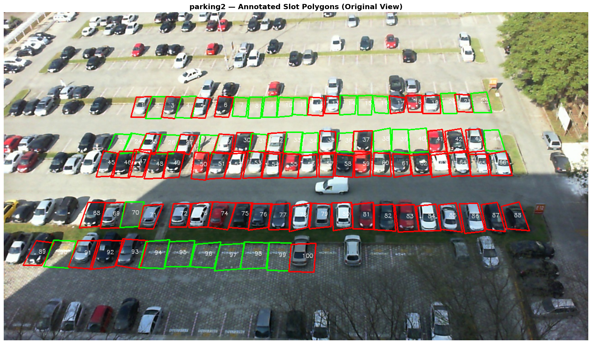

*Source: `outputs/screenshots/01_annotated_original.png` — 1280×720 PKLot frame, 100 slot polygons drawn from XML. Red outline = ground-truth OCCUPIED, green = VACANT.*

### 2. Perspective transformation (original → bird's-eye view)

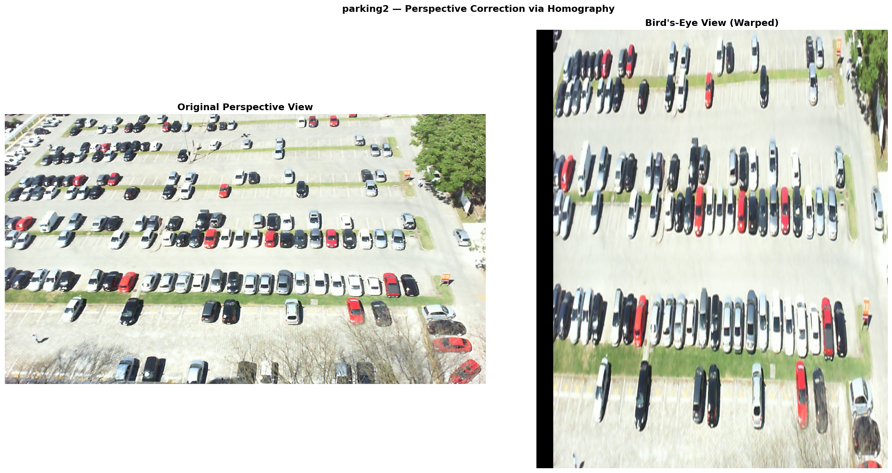

*Source: `outputs/screenshots/04_bev_comparison.png` — the 1280×720 oblique view warped through `H` into an 800×1000 rectified view.*

### 3. Correspondence points used to build the homography

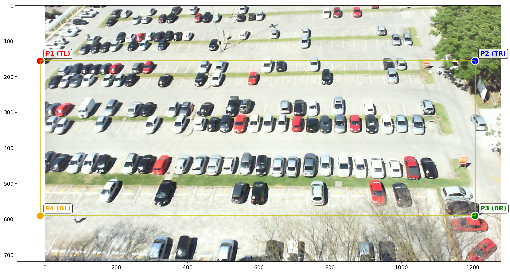

*Source: `outputs/screenshots/04_corner_points.png` — P1 (TL), P2 (TR), P3 (BR), P4 (BL) marked on the source frame.*

### 4. ROI selection — masks and slot layout

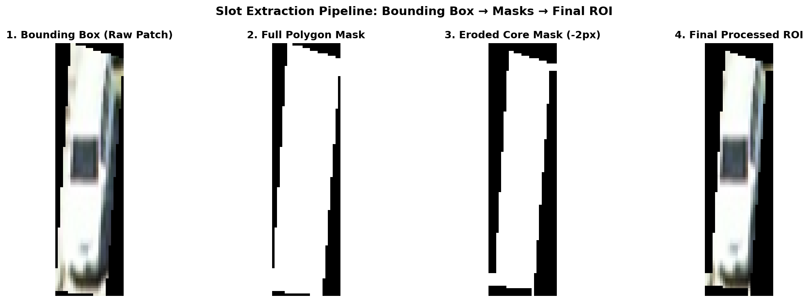

*Source: `outputs/screenshots/06_mask_extraction.png` — the four-panel extraction sequence: raw bounding-box patch → full polygon mask → eroded core mask → final masked ROI.*

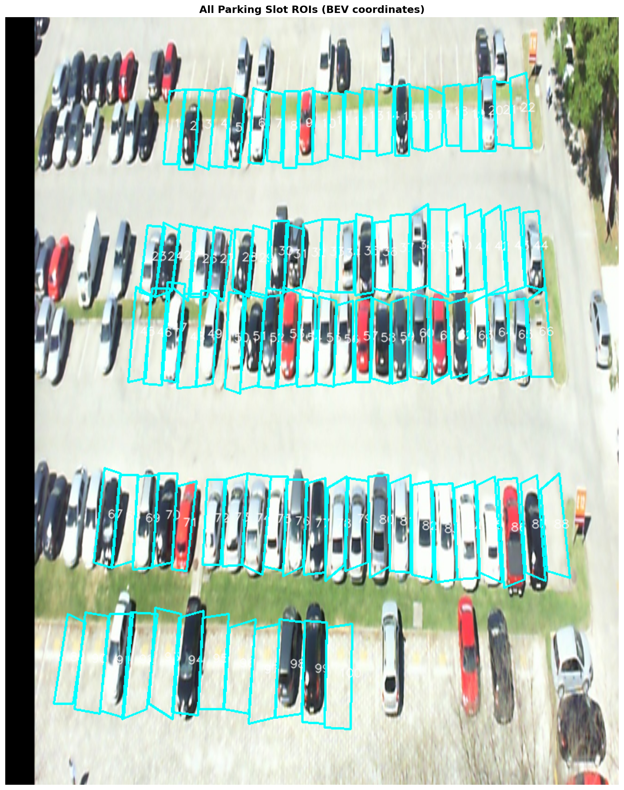

*Source: `outputs/screenshots/07_all_rois.png` — all 100 transformed slot polygons drawn on the BEV image.*

### 5. Threshold output — Global vs Adaptive vs Otsu vs Fused

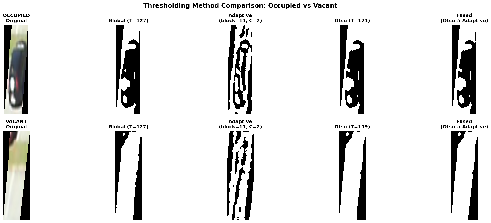

*Source: `outputs/screenshots/09_thresholding_compare.png` — top row an occupied slot, bottom row a vacant slot, across all four binarisation outputs.*

### 6. Morphological processing

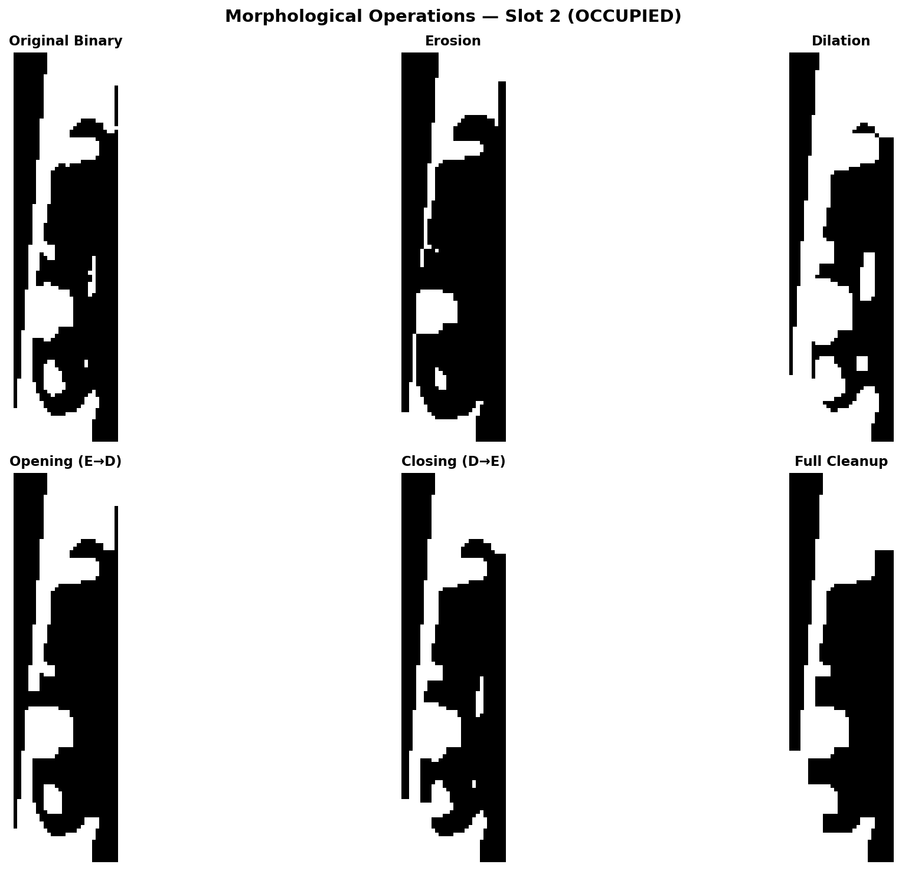

*Source: `outputs/screenshots/10_morphology_stages.png` — original binary, erosion, dilation, opening, closing, and the full cleanup pipeline.*

### 7. Occupancy detection — final annotated output

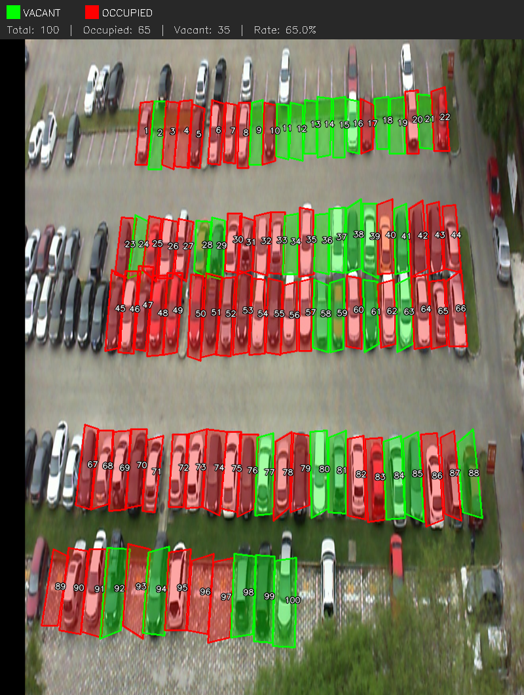

*Source: `outputs/annotated/rainy_result.png` — 800×1060 (1000 px BEV + 60 px statistics banner). Predicted 65.0 % occupancy.*

### 8. Final results gallery — all three weather conditions


*Source: `outputs/screenshots/19_results_gallery.png` — one annotated frame per weather condition with per-frame accuracy and F1 in the title.*

> **📌 Not available:** there is no animated GIF, no video demo, and no live web dashboard in this repository. `outputs/dashboard/`, `outputs/figures/`, `outputs/pipeline/`, `outputs/evaluation/` and `outputs/reports/` are **empty directories**.

---

## 🚀 Start Here — Three Ways to Read This Project

Development happened across nine sequential notebooks. For reading, presenting or grading, **use the combined build instead** — the same work assembled into one continuous narrative with every executed output preserved.

| I want to… | Open this | Notes |
|---|---|---|
| **Read the whole project as one story** | [`notebooks/00_COMPLETE_PROJECT.ipynb`](notebooks/00_COMPLETE_PROJECT.ipynb) | 160 cells · 9 acts · all 120 outputs and 33 figures intact. Clickable act navigation in the prologue. |
| **Present it live** | [`docs/presentation/parking-occupancy-presentation.html`](docs/presentation/parking-occupancy-presentation.html) | Standalone, self-contained. No Jupyter, no kernel, no way to wipe an output mid-talk. Download and double-click. |
| **Follow the talk track** | [`docs/presentation/PRESENTATION_SCRIPT.md`](docs/presentation/PRESENTATION_SCRIPT.md) | Act-by-act speaker script, prepared Q&A, and a timing card with cut markers for a 7-minute version. |
| **Audit the original work** | [`notebooks/01_explore.ipynb`](notebooks/01_explore.ipynb) → [`09_final_report.ipynb`](notebooks/09_final_report.ipynb) | The nine development notebooks, untouched. These remain the source of truth. |

### The nine acts

| Act | Title | Answers |
|---|---|---|
| **1** | Know Your Data Before You Touch It | What does the data actually look like? |
| **2** | The Camera Is Lying To You | How do I undo perspective distortion? |
| **3** | Carving the Lot Into 100 Bays | How do I get 100 independent measurements? |
| **4** | Making Noon and Dusk Comparable | How do I normalise across lighting? |
| **5** | From Grey to Black-and-White | How do I get a clean binary mask? |
| **6** | Eight Numbers That Describe a Parking Bay | What features actually separate the classes? |
| **7** | Where Exactly Do We Draw the Line? | How is the decision made without ML? |
| **8** | **The Verdict, and the Twist** | Does it work on 11,599 samples — and what went wrong? |
| **9** | What It Means, and What I'd Do Next | Honest limitations and next steps |

> 🔬 **How the combined notebook was built.** [`notebooks/build_combined_notebook.py`](notebooks/build_combined_notebook.py) merges the nine sources: it collapses nine duplicated import blocks into one setup cell, renumbers sections into a single arc, strips the `Next: Notebook NN` forward-pointers, re-attaches Act 4's four figures (which the `Agg` backend had written to disk instead of displaying inline), and recompresses photographic PNG outputs to JPEG — **27.15 MB → 6.04 MB**. The only outputs lost were docstring echoes and `Configuration loaded successfully!` chatter. Re-run it any time to regenerate.

---

## 📑 Table of Contents

- [🚀 Start Here — Three Ways to Read This Project](#-start-here--three-ways-to-read-this-project)
- [🖼️ The System at a Glance](#️-the-system-at-a-glance)
- [📖 Project Description](#-project-description)
- [✨ Features](#-features)
- [🎬 Project Demo](#-project-demo)
- [🏗️ Project Architecture](#️-project-architecture)
- [📂 Folder Structure](#-folder-structure)
- [⚙️ Installation](#️-installation)
- [📦 Requirements](#-requirements)
- [🗂️ Dataset](#️-dataset)
- [🔄 Project Workflow](#-project-workflow)
- [🖥️ Image Processing Pipeline](#️-image-processing-pipeline)
- [🧮 Algorithms Used](#-algorithms-used)
- [📓 Notebook Walkthrough](#-notebook-walkthrough)
- [🖼️ Output Gallery](#️-output-gallery)
- [📊 Results](#-results)
- [🌟 Project Highlights](#-project-highlights)
- [🧗 Challenges Faced](#-challenges-faced)
- [🚀 Future Improvements](#-future-improvements)
- [🏢 Applications](#-applications)
- [🎓 Learning Outcomes](#-learning-outcomes)
- [📄 License](#-license)
- [🙏 Acknowledgements](#-acknowledgements)
- [👤 Author](#-author)

---

## 🏗️ Project Architecture

### Design philosophy

The project is built in **three layers**, deliberately separated:

| Layer | Location | Responsibility |
|-------|----------|----------------|
| **Library** | `src/` (14 modules, ~4,100 lines) | Pure, testable functions. One module per pipeline stage. No notebook code. |
| **Experiments** | `notebooks/` (9 notebooks, ~3,350 lines) | Narrative, visualisation, tuning, evaluation. Imports from `src/`, never redefines logic. |
| **Presentation** | `notebooks/00_COMPLETE_PROJECT.ipynb` + `docs/presentation/` | All nine notebooks merged into one nine-act story with outputs preserved, plus a standalone HTML build and speaker script. Generated, never hand-edited. |
| **Artifacts** | `config/` | Everything learned during calibration: `H`, slot layout, tuned thresholds and weights. |

This means the calibration pipeline (Notebooks 01→07) runs **once**, produces three small config files, and inference thereafter needs only those files plus the source modules — not the 3.9 GB dataset.

### End-to-end data flow

```
                        ┌──────────────────────────┐
                        │   PKLot Camera Frame     │
                        │      1280 × 720 BGR      │
                        └────────────┬─────────────┘
                                     │
                                     ▼
                     ┌───────────────────────────────┐
                     │  QUALITY GATE                 │   io_utils.quality_gate()
                     │  brightness ≥ 30              │   cv2.Laplacian()
                     │  Laplacian variance ≥ 50      │
                     └───────────────┬───────────────┘
                                     │ pass
                                     ▼
                     ┌───────────────────────────────┐
                     │  PERSPECTIVE TRANSFORM        │   geometry.warp_perspective()
                     │  BEV warp via 3×3 H           │   cv2.warpPerspective()
                     │  output 800 × 1000            │   H from config/homography.npz
                     └───────────────┬───────────────┘
                                     │
                                     ▼
                     ┌───────────────────────────────┐
                     │  ROI EXTRACTION  (× 100)      │   roi.extract_slot_image()
                     │  bbox crop + polygon mask     │   cv2.boundingRect, cv2.fillPoly
                     │  + eroded core mask (−3 px)   │   roi.create_eroded_core_mask()
                     └───────────────┬───────────────┘
                                     │
              ╔══════════════════════▼══════════════════════╗
              ║        PER-SLOT LOOP  (100 iterations)      ║
              ╠═════════════════════════════════════════════╣
              ║                                             ║
              ║   ┌─────────────────────────────────────┐   ║
              ║   │  PREPROCESSING                      │   ║  preprocessing.preprocess_pipeline()
              ║   │  Grayscale (BT.601)                 │   ║  cv2.cvtColor
              ║   │      ↓                              │   ║
              ║   │  Gaussian blur 5×5                  │   ║  cv2.GaussianBlur
              ║   │      ↓                              │   ║
              ║   │  Median filter 3×3                  │   ║  cv2.medianBlur
              ║   │      ↓                              │   ║
              ║   │  CLAHE (clip 2.0, tiles 8×8)        │   ║  cv2.createCLAHE
              ║   └──────────────────┬──────────────────┘   ║
              ║                      ▼                      ║
              ║   ┌─────────────────────────────────────┐   ║
              ║   │  SEGMENTATION                       │   ║  segmentation.*
              ║   │  Otsu threshold ──┐                 │   ║  cv2.threshold + THRESH_OTSU
              ║   │                   ├─► soft-vote     │   ║  segmentation.fuse_channels()
              ║   │  Adaptive (11, 2)─┘    fusion       │   ║  cv2.adaptiveThreshold
              ║   └──────────────────┬──────────────────┘   ║
              ║                      ▼                      ║
              ║   ┌─────────────────────────────────────┐   ║
              ║   │  MORPHOLOGY                         │   ║  morphology.clean_binary_mask()
              ║   │  Opening 3×3  (kill speckle)        │   ║  cv2.morphologyEx MORPH_OPEN
              ║   │      ↓                              │   ║
              ║   │  Closing 5×5  (fill car holes)      │   ║  cv2.morphologyEx MORPH_CLOSE
              ║   │      ↓                              │   ║
              ║   │  Dilate 3×3 → Erode 3×3 (smooth)    │   ║  cv2.dilate / cv2.erode
              ║   └──────────────────┬──────────────────┘   ║
              ║                      ▼                      ║
              ║   ┌─────────────────────────────────────┐   ║
              ║   │  FEATURE EXTRACTION  → 8 scalars    │   ║  features.extract_all_features()
              ║   │  ρe edge density      (Canny)       │   ║  cv2.Canny
              ║   │  ρf foreground ratio  (binary)      │   ║  cv2.countNonZero
              ║   │  ḡ  gradient magnitude(Sobel)       │   ║  cv2.Sobel
              ║   │  σ² local variance    (statistics)  │   ║  np.var
              ║   │  α  largest component (CCA)         │   ║  cv2.connectedComponentsWithStats
              ║   │  σI intensity std     (statistics)  │   ║  np.std
              ║   │  η  Otsu separability (histogram)   │   ║  cv2.calcHist
              ║   │  S̄  mean saturation   (HSV)         │   ║  cv2.cvtColor BGR2HSV
              ║   └──────────────────┬──────────────────┘   ║
              ║                      ▼                      ║
              ║   ┌─────────────────────────────────────┐   ║
              ║   │  DECISION CASCADE                   │   ║  decide.classify_slot()
              ║   │                                     │   ║
              ║   │   ρe ≥ 0.2656 ──────► OCCUPIED      │   ║  fast path (4.9 % of slots)
              ║   │   ρe ≤ 0.1513 ──────► VACANT        │   ║  fast path (34.8 % of slots)
              ║   │   otherwise:                        │   ║  (60.3 % of slots)
              ║   │     S = Σ(wk·fk) / Σ(wk)            │   ║  Fisher-derived weights
              ║   │     S > 0.2921 ─────► OCCUPIED      │   ║
              ║   │     else ───────────► VACANT        │   ║
              ║   └──────────────────┬──────────────────┘   ║
              ║                      │                      ║
              ╚══════════════════════▼══════════════════════╝
                                     │
                                     ▼
                     ┌───────────────────────────────┐
                     │  STATISTICS                   │   stats.compute_statistics()
                     │  N, N_occ, N_vac, O%          │   stats.per_row_breakdown()
                     │  per-row breakdown            │   stats.format_report()
                     └───────────────┬───────────────┘
                                     │
                                     ▼
                     ┌───────────────────────────────┐
                     │  VISUALISATION                │   visualize.annotate_parking_image()
                     │  α-blended colour overlays    │   cv2.fillPoly + cv2.addWeighted
                     │  slot IDs + scores            │   cv2.putText
                     │  60 px statistics banner      │   visualize.create_legend()
                     └───────────────┬───────────────┘
                                     │
                                     ▼
                     ┌───────────────────────────────┐
                     │   Annotated BEV  800 × 1060   │
                     │   + occupancy report (text)   │
                     └───────────────────────────────┘
```

### Compact view

```
Camera Image → Quality Gate → Perspective Transform → ROI Extraction →
Preprocessing → Segmentation → Morphology → Feature Extraction →
Occupancy Decision → Statistics → Visualization
```

### Module dependency graph

```
                         ┌──────────┐
                         │  utils   │  (config loading, display helpers)
                         └────┬─────┘
                              │
  ┌─────────┐   ┌──────────┐  │  ┌──────────────┐   ┌──────────────┐
  │io_utils │   │ geometry │◄─┴─►│ preprocessing│   │ segmentation │
  └────┬────┘   └────┬─────┘     └──────┬───────┘   └──────┬───────┘
       │             │                  │                  │
       │             ▼                  │                  ▼
       │        ┌─────────┐             │           ┌────────────┐
       └───────►│   roi   │             │           │ morphology │
                └────┬────┘             │           └─────┬──────┘
                     │                  │                 │
                     └──────────┬───────┴─────────────────┘
                                ▼
                          ┌──────────┐
                          │ features │
                          └────┬─────┘
                               ▼
                          ┌──────────┐        ┌──────────┐
                          │  decide  │───────►│  stats   │
                          └────┬─────┘        └────┬─────┘
                               │                   │
                               ▼                   ▼
                       ┌────────────┐       ┌────────────┐
                       │  evaluate  │       │ visualize  │
                       └────────────┘       └────────────┘
                               │                   │
                               └─────────┬─────────┘
                                         ▼
                                   ┌──────────┐
                                   │ pipeline │  (orchestrator)
                                   └──────────┘
```

---
## 📂 Folder Structure

### Complete project tree

```
parking-occupancy-estimation/
│
├── README.md                          # This document
├── requirements.txt                   # Pinned dependencies + prohibition list
│
├── config/                            # 🔧 Calibration artifacts (the "trained" state)
│   ├── config.yaml                    # Master parameter file (paths, kernels, colours)
│   ├── homography.npz                 # H matrix, output_size, px_per_metre, src/dst points
│   ├── slots.json                     # 100 slot polygons in BEV coordinates
│   └── thresholds.yaml                # Tuned decision thresholds + Fisher-derived weights
│
├── data/
│   ├── raw/
│   │   ├── PKLot.tar.gz               # Original dataset archive (3.6 GB) — NOT in git
│   │   └── PKLot/                     # Extracted dataset (3.9 GB) — NOT in git
│   │       ├── parking1a/             #   3,791 frames
│   │       ├── parking1b/             #   4,152 frames
│   │       └── parking2/              #   4,473 frames  ← PRIMARY LOT
│   │           ├── sunny/YYYY-MM-DD/  #     *.jpg + matching *.xml
│   │           ├── cloudy/YYYY-MM-DD/
│   │           └── rainy/YYYY-MM-DD/
│   │
│   ├── samples/                       # 21 curated frames (7 per weather) + 21 XMLs = 42 files
│   │   ├── sunny_2012-09-11_15_16_58.jpg / .xml
│   │   ├── cloudy_2012-10-12_08_52_37.jpg / .xml
│   │   └── rainy_2012-10-11_12_46_44.jpg / .xml    (etc.)
│   │
│   ├── ground_truth/
│   │   ├── labels.csv                 # 42,318 rows — every slot of 448 frames + corner coords
│   │   └── feature_vectors.csv        # 2,802 rows — 8 features + weather + label per slot
│   │
│   ├── annotations/                   # ⚠️ EMPTY (declared in config.yaml, never written to)
│   └── processed/                     # ⚠️ EMPTY (declared in config.yaml, never written to)
│
├── notebooks/                         # 📓 9 notebooks, each paired .ipynb + .py (jupytext)
│   ├── 00_COMPLETE_PROJECT.ipynb      # ⭐ ALL 9 MERGED — 9 acts, all outputs. Read/present this
│   ├── build_combined_notebook.py     # Reproducible merge script that generates 00_
│   │
│   ├── 01_explore.ipynb / .py         # Dataset exploration & EDA
│   ├── 02_geometry.ipynb / .py        # Camera geometry & homography
│   ├── 03_roi.ipynb / .py             # ROI extraction & masking
│   ├── 04_preprocessing.ipynb / .py   # Preprocessing ladder
│   ├── 05_segmentation.ipynb / .py    # Thresholding, shadows & morphology
│   ├── 06_features.ipynb / .py        # Feature extraction & Fisher analysis
│   ├── 07_threshold_tuning.ipynb/.py  # Threshold calibration & first evaluation
│   ├── 08_evaluation.ipynb / .py      # Large-scale evaluation & timing
│   ├── 09_final_report.ipynb / .py    # Final report & results gallery
│   │
│   ├── config -> ../config            # symlink, so notebooks run from either directory
│   ├── data   -> ../data              # symlink
│   ├── outputs-> ../outputs           # symlink
│   └── src    -> ../src               # symlink
│
├── src/                               # 🐍 Source library — 14 modules
│   ├── __init__.py                    # Package docstring, __version__ = "1.0.0"
│   ├── io_utils.py         (311 L)    # PKLot XML parsing, frame listing, quality gate, GT export
│   ├── geometry.py         (308 L)    # Homography computation, warping, point transformation
│   ├── roi.py              (411 L)    # Slot polygons, masks, eroded cores, JSON persistence
│   ├── preprocessing.py    (254 L)    # Grayscale, HE, CLAHE, Gaussian, median, ladder
│   ├── segmentation.py     (322 L)    # Global/adaptive/Otsu thresholds, shadow HSV, fusion
│   ├── morphology.py       (258 L)    # Erosion, dilation, opening, closing, cleanup, grid
│   ├── features.py         (506 L)    # 8 feature extractors + Fisher discriminant ratio
│   ├── decide.py           (419 L)    # Cascade classifier, hysteresis, neighbour refinement
│   ├── stats.py            (128 L)    # Occupancy counts, per-row breakdown, text report
│   ├── visualize.py        (447 L)    # Annotation, legend banner, dashboards, figure saving
│   ├── evaluate.py         (319 L)    # Confusion matrix, metrics, Timer class, plots
│   ├── pipeline.py         (217 L)    # ParkingPipeline orchestrator class
│   └── utils.py            (171 L)    # Config loading, image I/O, display grid, separators
│
├── outputs/
│   ├── screenshots/                   # ✅ 29 generated figures (37 MB) — see Output Gallery
│   ├── annotated/                     # ✅ 3 final annotated results (sunny/cloudy/rainy)
│   ├── pipeline/                      # ⚠️ EMPTY (declared in config.yaml)
│   ├── dashboard/                     # ⚠️ EMPTY (declared in config.yaml)
│   ├── figures/                       # ⚠️ EMPTY
│   ├── evaluation/                    # ⚠️ EMPTY (declared in config.yaml)
│   └── reports/                       # ⚠️ EMPTY
│
├── docs/
│   ├── diagrams/                      # ⚠️ EMPTY
│   └── presentation/                  # 🎤 Presentation material
│       ├── parking-occupancy-presentation.html   # Standalone build of 00_ (7.6 MB, no Jupyter needed)
│       └── PRESENTATION_SCRIPT.md                # Act-by-act speaker script + Q&A + timing card
│
└── venv/                              # Python 3.12.3 virtual environment (752 MB) — NOT in git
```

### What every folder is for

| Folder | Purpose | Status |
|--------|---------|--------|
| `config/` | The four artifacts that make inference reproducible without the dataset. Produced by Notebooks 02, 03 and 07. | ✅ Populated |
| `data/raw/` | Unmodified PKLot dataset — archive plus extracted tree. 7.5 GB combined. | ✅ Populated |
| `data/samples/` | 21 representative frames copied out by `curate_samples()` for fast iteration without touching the full dataset. | ✅ Populated |
| `data/ground_truth/` | Two CSVs: parsed XML labels, and the extracted feature matrix used for threshold tuning. | ✅ Populated |
| `data/annotations/` | Declared in `config.yaml` as `paths.annotations`. No code writes here. | ⚠️ Empty |
| `data/processed/` | Declared in `config.yaml` as `paths.data_processed`. No code writes here. | ⚠️ Empty |
| `notebooks/` | The narrative: 9 sequential notebooks that build, calibrate and evaluate the system, plus `00_COMPLETE_PROJECT.ipynb` merging all nine into one story. Symlinks let them run from either the project root or the notebooks directory. | ✅ Populated |
| `src/` | The reusable library. Every notebook imports from here; no algorithm is defined inside a notebook. | ✅ Populated |
| `outputs/screenshots/` | Every figure produced by the notebooks, auto-saved by `visualize.show_and_save_fig()`. | ✅ 29 files |
| `outputs/annotated/` | Final colour-coded results written by Notebook 08. | ✅ 3 files |
| `outputs/pipeline`, `dashboard`, `figures`, `evaluation`, `reports` | Reserved output directories. `config.yaml` names four of them, but no executed code writes to any. | ⚠️ Empty |
| `docs/presentation/` | Standalone HTML build of the combined notebook, plus the speaker script. | ✅ 2 files |
| `docs/diagrams/` | Reserved for architecture diagrams. The architecture is documented as ASCII in this README instead. | ⚠️ Empty |
| `venv/` | Local virtual environment. Should be excluded from version control. | ✅ Present |

### Important files explained

<details>
<summary><b>config/config.yaml</b> — master parameter file (click to expand)</summary>

Central place for tunable parameters, grouped into seven sections:

| Section | Keys | Used by executed code? |
|---------|------|------------------------|
| `paths` | 7 output/input directories | Partially — 4 of the named directories are never written to |
| `preprocessing` | `clahe_clip_limit: 2.0`, `clahe_grid_size: [8,8]`, `gaussian_kernel: [5,5]`, `median_kernel: 5` | Values match the module defaults, but modules are called with their own defaults (median kernel is **3**, not 5) |
| `segmentation` | `global_threshold: 127`, `adaptive_block_size: 11`, `adaptive_constant: 2` | Values match what the notebooks pass |
| `morphology` | `kernel_size: [3,3]`, `erosion_iterations: 1`, `dilation_iterations: 1` | Matches module defaults |
| `features` | `canny_low: 50`, `canny_high: 150` | Matches `extract_all_features()` defaults |
| `decision` | `edge_density_threshold: 0.1`, `foreground_ratio_threshold: 0.25`, `pixel_variance_threshold: 500`, `min_features_above_threshold: 2` | ⚠️ **Not used.** This is an earlier "vote-counting" decision design. The shipped classifier reads `thresholds.yaml` instead. |
| `perspective` | `output_size: [600, 800]` | ⚠️ **Not used.** Notebook 02 hard-codes `BEV_WIDTH=800`, `BEV_HEIGHT=1000`, and that is what is stored in `homography.npz`. |
| `visualization` | BGR colours, `overlay_alpha: 0.35`, font settings | Values match the hard-coded defaults in `visualize.py` |

</details>

<details>
<summary><b>config/homography.npz</b> — camera calibration</summary>

NumPy archive with five arrays:

| Key | Value |
|-----|-------|
| `H` | 3×3 float64 homography matrix |
| `output_size` | `[800, 1000]` |
| `px_per_metre` | `14.40495097` |
| `src_points` | 4×2 float32 — source quadrilateral in the original frame |
| `dst_points` | 4×2 float32 — destination rectangle in BEV |

The stored matrix is:

```
H = [[ 6.06607123e-01, -4.17072400e-19,  3.81588657e+01],
     [-7.43565759e-19,  2.16340621e+00, -3.05868815e+02],
     [-2.47855243e-20, -7.01094860e-38,  1.00000000e+00]]

det(H) = 1.312338   →  non-degenerate, invertible
```

**Read this matrix carefully.** The off-diagonal terms (`h12`, `h21`) and the projective row (`h31`, `h32`) are all ~1e-19 or smaller — numerically zero. So `H` reduces to:

```
x' = 0.6066·x + 38.16          (horizontal scale ×0.61)
y' = 2.1634·y − 305.87         (vertical scale ×2.16)
```

That is an **anisotropic scale plus translation**, not a projective rectification. The reason is documented in [Challenges Faced](#-challenges-faced): the source points were derived from the axis-aligned bounding box of all slot polygons, so the source quadrilateral is already a rectangle, and mapping a rectangle to a rectangle can only ever produce an affine scale.

</details>

<details>
<summary><b>config/slots.json</b> — parking bay layout</summary>

```json
{
  "coordinate_system": "bev",
  "num_slots": 100,
  "slots": {
    "1": [[206.79, 191.71], [214.07, 96.52], [234.69, 94.36], [224.99, 191.71]],
    "2": [...]
  }
}
```

100 slots, each a 4-vertex polygon in **BEV pixel coordinates**. Written once by Notebook 03; every downstream stage loads this instead of re-parsing XML.

</details>

<details>
<summary><b>config/thresholds.yaml</b> — the tuned decision rule</summary>

```yaml
thresholds:
  edge_density_high: 0.2655568755568755    # fast-path → OCCUPIED
  edge_density_low:  0.15126117622227564   # fast-path → VACANT
  score_threshold:   0.2921212121212121    # weighted-score decision boundary
  confidence_low:    0.2
weights:
  edge_density:       0.06394634871445837
  foreground_ratio:   0.11153494180643117
  gradient_magnitude: 0.3034710363221578
  local_variance:     0.19054292043999196
  largest_component:  0.07858501744951239
  intensity_std:      0.21661217567663768
  otsu_separability:  0.030072897712578477
  mean_saturation:    0.005234661878232194
```

Eight weights summing to 1.0, each proportional to that feature's Fisher discriminant ratio. Written by Notebook 07.

</details>

<details>
<summary><b>Paired .ipynb / .py notebooks (jupytext)</b></summary>

Every notebook exists twice:

- **`.ipynb`** — the executed notebook with stored outputs (printed text and embedded PNG figures)
- **`.py`** — the same content as a percent-format script with `# %%` cell markers and `# %% [markdown]` prose cells

The `.py` files are the readable, diff-friendly, version-control-friendly source. Regenerate a notebook with:

```bash
jupytext --to notebook notebooks/01_explore.py
```

`jupytext` is installed in the project's virtual environment.

</details>

---

## ⚙️ Installation

### Prerequisites

| Requirement | Version used | Notes |
|-------------|--------------|-------|
| Python | **3.12.3** | Recorded in the notebook metadata |
| Disk space | **~8.5 GB** | 3.6 GB archive + 3.9 GB extracted + 752 MB venv |
| RAM | 4 GB+ | Frames are 1280×720; only one is in memory at a time |
| OS | macOS / Linux / Windows | Developed on macOS (Darwin 25.5.0) |
| GPU | **Not required** | The entire pipeline is CPU-only by design |

### Step 1 — Clone the repository

```bash
git clone <your-repository-url>
cd parking-occupancy-estimation
```

### Step 2 — Create and activate a virtual environment

```bash
# Create
python3 -m venv venv

# Activate — macOS / Linux
source venv/bin/activate

# Activate — Windows (PowerShell)
venv\Scripts\Activate.ps1

# Activate — Windows (cmd)
venv\Scripts\activate.bat
```

Confirm you are inside it:

```bash
python --version        # → Python 3.12.3
which python            # → .../parking-occupancy-estimation/venv/bin/python
```

### Step 3 — Install dependencies

```bash
pip install --upgrade pip
pip install -r requirements.txt
```

Verify the core stack imports cleanly:

```bash
python -c "import cv2, numpy, matplotlib, pandas, seaborn, yaml; \
print('OpenCV', cv2.__version__); print('NumPy', numpy.__version__)"
```

Expected:

```
OpenCV 4.10.0
NumPy 1.26.4
```

### Step 4 — Obtain and place the dataset

The PKLot dataset is **not included in this repository** (7.5 GB). Download it from the official source:

- **Official page:** <https://web.inf.ufpr.br/vri/databases/parking-lot-database/>

Extract it so the tree looks like this:

```bash
mkdir -p data/raw
# place PKLot.tar.gz into data/raw/ then:
tar -xzf data/raw/PKLot.tar.gz -C data/raw/
```

Expected result:

```
data/raw/PKLot/
├── parking1a/{sunny,cloudy,rainy}/YYYY-MM-DD/*.jpg + *.xml
├── parking1b/{sunny,cloudy,rainy}/YYYY-MM-DD/*.jpg + *.xml
└── parking2/{sunny,cloudy,rainy}/YYYY-MM-DD/*.jpg + *.xml
```

> **⚠️ Folder-naming note.** The code expects **lowercase** lot and weather directory names — `parking2/sunny/`, not `UFPR05/Sunny/`. `io_utils.list_frames()` searches for the literal directories `sunny`, `cloudy`, `rainy`, and the notebooks reference `parking1a`, `parking1b`, `parking2`. If your extracted archive uses the original PKLot naming (`PUCPR`, `UFPR04`, `UFPR05` with `Sunny`/`Cloudy`/`Rainy`), rename the directories to lowercase or adjust the constants at the top of each notebook.

Verify the dataset is visible to the code:

```bash
python -c "
import sys; sys.path.insert(0,'.')
from src.io_utils import list_frames
f = list_frames('data/raw/PKLot/parking2')
print(f'{len(f)} frames found')
"
```

Expected: `4473 frames found`

### Step 5 — Register the Jupyter kernel and launch

```bash
python -m ipykernel install --user --name parking-occupancy --display-name "Parking Occupancy"
jupyter notebook notebooks/
```

### Step 6 — Run the notebooks in order

Execute them sequentially, **01 → 09**. The order matters because each notebook consumes artifacts produced by the previous ones:

| Run | Notebook | Produces | Required by |
|-----|----------|----------|-------------|
| 1 | `01_explore.ipynb` | `data/ground_truth/labels.csv`, `data/samples/` | — |
| 2 | `02_geometry.ipynb` | `config/homography.npz` | 03–09 |
| 3 | `03_roi.ipynb` | `config/slots.json` | 04–09 |
| 4 | `04_preprocessing.ipynb` | figures only | — |
| 5 | `05_segmentation.ipynb` | figures only | — |
| 6 | `06_features.ipynb` | `data/ground_truth/feature_vectors.csv` | 07, 09 |
| 7 | `07_threshold_tuning.ipynb` | `config/thresholds.yaml` | 08, 09 |
| 8 | `08_evaluation.ipynb` | `outputs/annotated/*.png` | — |
| 9 | `09_final_report.ipynb` | `outputs/screenshots/19_results_gallery.png` | — |

Notebooks 02, 03 and 07 are the three that **must** be run before anything downstream — they write the `config/` artifacts. Notebooks 04 and 05 are purely illustrative and can be skipped without breaking the chain.

### Step 7 — Run the pipeline programmatically

The `config/` files shipped with this repository are already calibrated, so you can run inference **without** running any notebook:

```python
import sys, cv2
sys.path.insert(0, '.')

from src.pipeline import ParkingPipeline

pipeline = ParkingPipeline('config/')
image = cv2.imread('data/samples/sunny_2012-09-11_15_16_58.jpg')

result = pipeline.process_frame(image)

print(result['report'])                          # formatted occupancy report
print(result['stats'])                           # {'total_spaces': 100, 'occupied': .., ...}
cv2.imwrite('my_output.png', result['annotated'])
```

`result` is a dictionary containing:

| Key | Type | Contents |
|-----|------|----------|
| `labels` | `dict[int, int]` | slot_id → 0 (vacant) / 1 (occupied) |
| `confidences` | `dict[int, float]` | slot_id → decision confidence 0–1 |
| `scores` | `dict[int, float]` | slot_id → raw weighted score |
| `stats` | `dict` | `total_spaces`, `occupied`, `vacant`, `occupancy_pct` |
| `row_stats` | `dict` | the same four figures, per parking row |
| `report` | `str` | formatted text report with an ASCII occupancy bar |
| `annotated` | `np.ndarray` | 800×1060 BGR annotated BEV image |
| `bev` | `np.ndarray` | 800×1000 BGR bird's-eye view |
| `timing` | `dict` | mean milliseconds per stage |

> **📌 Note.** No notebook currently instantiates `ParkingPipeline`; the notebooks inline the same stage sequence directly. The class is complete and importable, but its end-to-end behaviour is not covered by the executed notebook outputs. It also **omits** the HSV shadow-suppression step, matching the notebooks.

### Step 8 — Recommended repository hygiene

This repository currently has **no `.gitignore`** and **no commits** (`git log` reports the branch has no commits yet). Before your first commit, exclude the large artifacts:

```bash
cat > .gitignore <<'EOF'
venv/
data/raw/
__pycache__/
*.pyc
.ipynb_checkpoints/
.DS_Store
EOF
```

Without this, a `git add .` would attempt to commit **8.2 GB** of virtual environment and dataset.

---

## 📦 Requirements

### Declared dependencies (`requirements.txt`)

| Package | Pinned version | Purpose | Actually imported? |
|---------|---------------|---------|--------------------|
| `opencv-python` | **4.10.0.84** | Core computer vision — every transform, filter, threshold, morphology and feature operation | ✅ Yes — `src/` (11 modules) and all notebooks |
| `numpy` | **1.26.4** | Array operations, linear algebra, statistics | ✅ Yes — everywhere |
| `matplotlib` | **3.9.2** | All plotting and figure generation | ✅ Yes — `visualize.py`, `evaluate.py`, `utils.py`, all notebooks |
| `pandas` | **2.2.2** | CSV export/import, feature tables, summary statistics | ✅ Yes — `io_utils.py`, notebooks 01, 02, 06, 07, 08, 09 |
| `PyYAML` | **6.0.2** | Reads `config.yaml` and reads/writes `thresholds.yaml` | ✅ Yes — `utils.py`, `decide.py` |
| `seaborn` | **0.13.2** | Confusion-matrix heat-map rendering | ✅ Yes — `evaluate.py` only |
| `jupyter` | **1.1.1** | Notebook environment | ✅ Yes — runtime |
| `ipykernel` | **6.29.5** | Jupyter kernel backend | ✅ Yes — runtime |
| `scikit-image` | **0.24.0** | Listed as "supplementary image processing functions" | ⚠️ **Never imported.** No `import skimage` exists anywhere in `src/` or `notebooks/`. |
| `tqdm` | **4.66.5** | Listed for progress bars | ⚠️ **Never imported.** Notebooks print progress with plain `print()` every 5–20 frames. |

Two packages are therefore installable-but-unused. They are documented here rather than silently removed, because `requirements.txt` is a project artifact and this README describes what exists.

### Standard-library modules used

| Module | Used for |
|--------|----------|
| `xml.etree.ElementTree` | Parsing PKLot XML annotations |
| `os`, `sys`, `glob` | Path handling, file discovery, import paths |
| `json` | `slots.json` read/write |
| `shutil` | Copying curated sample frames |
| `time` | `perf_counter()` in the `Timer` benchmarking class |

### Explicitly prohibited (enforced by project constraints)

```
❌ tensorflow      ❌ torch / pytorch     ❌ keras
❌ ultralytics     ❌ detectron2          ❌ any pretrained model package
❌ sklearn classifiers
```

Verify compliance at any time:

```bash
grep -rniE "tensorflow|torch|keras|ultralytics|detectron|sklearn" src/ notebooks/*.py
# → no matches
```

### Reproducibility notes

- **Random seed:** `np.random.seed(42)` is set in notebooks 01, 02 and 03. The pipeline itself is fully deterministic — no stochastic component exists in any stage.
- **Environment:** developed and executed on macOS (Darwin 25.5.0) with Python 3.12.3.
- **Determinism:** given identical inputs and config files, every run produces byte-identical outputs.

---
## 🗂️ Dataset

### Name and source

| Attribute | Value |
|-----------|-------|
| **Name** | **PKLot** — A Robust Dataset for Parking Lot Classification |
| **Origin** | Federal University of Paraná (UFPR), Curitiba, Brazil — Vision Robotics and Imaging Laboratory |
| **Official page** | <https://web.inf.ufpr.br/vri/databases/parking-lot-database/> |
| **Reference paper** | Almeida, P., Oliveira, L.S., Britto, A.S., Silva, E.J., Koerich, A.L. — *"PKLot – A Robust Dataset for Parking Lot Classification"*, Expert Systems with Applications, 42(11), 2015 |
| **Archive in this repo** | `data/raw/PKLot.tar.gz` — 3.6 GB |
| **Extracted size** | `data/raw/PKLot/` — 3.9 GB |
| **Included in git?** | ❌ No — must be downloaded separately |

### Why this dataset was selected

| Reason | Detail |
|--------|--------|
| **Per-slot polygon annotations** | Every image ships with an XML file giving the exact 4-corner polygon *and* the occupancy label for every bay. No manual annotation was needed for 100 slots. |
| **Fixed camera** | Each lot is filmed from a static mount, so a **single homography** calibrates the whole lot for all ~4,500 frames. A moving camera would make this project impossible without per-frame calibration. |
| **Explicit weather labelling** | Frames are pre-sorted into `sunny`, `cloudy` and `rainy` directories, which makes per-weather robustness analysis a directory listing rather than a manual sorting task. |
| **Scale** | 12,416 frames across three lots gives enough data for a genuine held-out evaluation instead of a demo on three cherry-picked images. |
| **Difficulty** | It contains the exact failure modes a classical pipeline must confront: hard shadows, wet reflective asphalt, overcast low-contrast lighting, and inter-vehicle occlusion. |
| **Benchmark status** | It is a widely cited standard, so results are comparable against published work. |

### Directory structure

The dataset is organised **lot → weather → date → files**:

```
data/raw/PKLot/
├── parking1a/
│   ├── sunny/2012-09-11/ ... 2012-…/          (*.jpg + *.xml pairs)
│   ├── cloudy/…
│   └── rainy/…
├── parking1b/
│   └── …
└── parking2/                                   ← PRIMARY LOT USED
    ├── sunny/2012-09-11/
    │   ├── 2012-09-11_15_16_58.jpg
    │   ├── 2012-09-11_15_16_58.xml
    │   ├── 2012-09-11_15_27_08.jpg
    │   ├── 2012-09-11_15_27_08.xml
    │   └── …
    ├── cloudy/…
    └── rainy/…
```

Every `.jpg` has a same-named `.xml` sibling. `io_utils.list_frames()` walks this tree and returns only pairs where **both** files exist.

### Measured dataset composition

These counts were produced by running Notebook 01 against the local copy:

| Lot | Total frames | Sunny | Cloudy | Rainy |
|-----|-------------:|------:|-------:|------:|
| `parking1a` | 3,791 | 2,098 (20 dates) | 1,408 (15 dates) | 285 (14 dates) |
| `parking1b` | 4,152 | 2,500 (25 dates) | 1,426 (19 dates) | 226 (8 dates) |
| **`parking2`** ⭐ | **4,473** | **2,314 (24 dates)** | **1,328 (11 dates)** | **831 (8 dates)** |
| **Total** | **12,416** | 6,912 | 4,162 | 1,342 |

**`parking2` was chosen as the primary lot** because it has the most frames overall *and* by far the best rainy-weather coverage (831 frames vs. 285 and 226), which matters for the per-weather robustness analysis.

### Image properties

| Property | Value |
|----------|-------|
| Resolution | **1280 × 720** pixels |
| Format | JPEG, 3-channel BGR when loaded by OpenCV |
| Viewpoint | Elevated oblique — camera looks down at ~4 rows of bays |
| Slots per frame (`parking2`) | **100** in the calibrated layout; individual XML files sometimes list 99 (e.g. `2012-09-11_15_16_58.xml` has 99 `<space>` elements) |
| Timestamp | Encoded in the filename: `YYYY-MM-DD_HH_MM_SS.jpg` |

### Annotation format

Each XML follows this structure:

```xml
<parking>
    <space id="1" occupied="1">
        <rotatedRect> ... </rotatedRect>
        <contour>
            <point x="278" y="230"/>
            <point x="290" y="186"/>
            <point x="324" y="185"/>
            <point x="308" y="230"/>
        </contour>
    </space>
    <space id="2" occupied="0">
        ...
    </space>
</parking>
```

`io_utils.parse_pklot_xml()` reads each `<space>` and extracts:

| Field | Source | Type |
|-------|--------|------|
| `id` | `space@id` | `int` — slot identifier |
| `occupied` | `space@occupied` | `int` — `0` = vacant, `1` = occupied |
| `points` | `contour/point@x,@y` | `np.ndarray` (N×2 float32) — polygon vertices |

Two guard conditions are applied: a `<space>` with **no** `occupied` attribute is skipped entirely (some frames have unlabelled bays), and a contour with **fewer than 3 points** is rejected because it cannot form a polygon.

Real parsed output from Notebook 01:

```
Parsing: data/raw/PKLot/parking2/sunny/2012-09-11/2012-09-11_15_16_58.xml

Found 99 parking slots

  Slot   1: OCCUPIED    Corners: (278,230) (290,186) (324,185) (308,230)
  Slot   2: VACANT      Corners: (325,185) (355,185) (344,233) (310,233)
  Slot   3: OCCUPIED    Corners: (355,185) (388,186) (374,233) (345,230)
  Slot   4: VACANT      Corners: (389,185) (421,184) (412,232) (375,231)
  Slot   5: OCCUPIED    Corners: (421,187) (452,190) (441,232) (409,231)

  Summary: 99 total, 67 occupied, 32 vacant
```

### Derived data in this repository

<table>
<tr><th>File</th><th>Rows</th><th>Contents</th><th>Produced by</th></tr>
<tr>
<td><code>data/ground_truth/labels.csv</code></td>
<td>42,318</td>
<td>Every slot of every 10th <code>parking2</code> frame (448 frames): <code>frame_path</code>, <code>weather</code>, <code>date</code>, <code>slot_id</code>, <code>occupied</code>, <code>x1..x4</code>, <code>y1..y4</code></td>
<td>Notebook 01</td>
</tr>
<tr>
<td><code>data/ground_truth/feature_vectors.csv</code></td>
<td>2,802</td>
<td>The computed 8-feature vector for each slot of 30 sampled frames, plus <code>slot_id</code>, <code>weather</code> and the <code>occupied</code> label</td>
<td>Notebook 06</td>
</tr>
<tr>
<td><code>data/samples/</code></td>
<td>42 files</td>
<td>21 curated frames (7 sunny + 7 cloudy + 7 rainy) with their XML siblings, evenly spaced through the dataset</td>
<td>Notebook 01</td>
</tr>
</table>

**Class balance in `labels.csv`** — 22,842 vacant vs. 19,476 occupied (54.0 % / 46.0 %). Reasonably balanced, which means raw accuracy is a meaningful metric here rather than a trivially-inflated one.

---

## 🔄 Project Workflow

This section walks through every phase in execution order. Each phase lists **purpose, input, processing, output, visualisation, why it is needed** and the **expected result**.

---

### Phase 1 — Dataset loading & structure discovery

| | |
|---|---|
| **Purpose** | Discover what data exists and build a machine-readable index of it |
| **Input** | `data/raw/PKLot/` directory tree |
| **Processing** | `list_frames()` walks lot → weather → date, globs `*.jpg`/`*.png`, and keeps only images that have a matching `.xml` |
| **Output** | A list of dicts, each with `image_path`, `xml_path`, `weather`, `date`, `timestamp` |
| **Visualisation** | Printed per-lot, per-weather frame counts |
| **Why needed** | Nothing downstream can run without a validated inventory of image/annotation pairs |
| **Expected result** | 12,416 frames across 3 lots; `parking2` selected with 4,473 frames |

---

### Phase 2 — Exploratory data analysis

| | |
|---|---|
| **Purpose** | Understand the data before touching it — lighting, contrast, slot geometry |
| **Input** | Sampled frames from each weather condition |
| **Processing** | 3×3 sample grid; grayscale + per-channel RGB histograms via `cv2.calcHist`; slot-area statistics via `cv2.contourArea` |
| **Output** | Histogram figures, slot-area distribution, area min/max/mean/std |
| **Visualisation** | `02_samples_grid.png`, `02_histograms.png`, `01_annotated_original.png` |
| **Why needed** | Histogram shape decides whether Otsu (needs bimodality) is viable; the area spread quantifies perspective distortion |
| **Expected result** | Sunny = high contrast + hard shadows; cloudy = compressed dynamic range; rainy = darker with reflections |

**Measured slot areas (original image coordinates):**

| Statistic | Value |
|-----------|------:|
| Min | 1,138 px² |
| Max | 3,350 px² |
| Mean | 1,974 px² |
| Std | 581 px² |
| **Max / Min ratio** | **2.9×** |

> **Note on documentation accuracy.** The markdown prose inside Notebook 01 states the ratio is "up to 8x". The **measured** value from the same notebook's executed output is **2.9×**. This README reports the measured figure.

---

### Phase 3 — Quality gate

| | |
|---|---|
| **Purpose** | Reject unusable frames before they waste processing time or corrupt statistics |
| **Input** | A BGR frame |
| **Processing** | Mean grayscale intensity (brightness); variance of `cv2.Laplacian(gray, CV_64F)` (focus measure) |
| **Output** | `(passes: bool, diagnostics: dict)` with `brightness`, `blur_score`, `too_dark`, `too_blurry` |
| **Visualisation** | Printed PASS/REJECT per frame with both scores |
| **Why needed** | A night-time or motion-blurred frame produces garbage edge densities that would silently poison the evaluation |
| **Expected result** | Daytime PKLot frames pass comfortably |

**Measured on the first 5 frames:** brightness 117.7 – 132.5 (threshold 30), blur score 397.1 – 435.0 (threshold 50). All ✅ PASS with an ~8× margin on both criteria.

---

### Phase 4 — Ground-truth export and sample curation

| | |
|---|---|
| **Purpose** | Flatten thousands of XML files into one CSV, and carve out a small working set |
| **Input** | Every 10th frame of `parking2` (448 frames) |
| **Processing** | `export_ground_truth_csv()` parses each XML and emits one row per slot; `curate_samples()` copies evenly-spaced frames into `data/samples/` |
| **Output** | `labels.csv` (42,318 rows), 21 curated frame/XML pairs |
| **Visualisation** | Printed class distribution and CSV head |
| **Why needed** | Evaluation needs a fast tabular lookup, not repeated XML parsing; the curated set makes iteration fast without loading 3.9 GB |
| **Expected result** | Balanced classes and 7 curated frames per weather |

**Measured:** 42,318 rows from 448 unique frames — 22,842 vacant, 19,476 occupied. Curated 21 frames (7 sunny / 7 cloudy / 7 rainy).

---

### Phase 5 — Camera geometry & homography computation

| | |
|---|---|
| **Purpose** | Build the 3×3 matrix that rectifies the oblique camera view |
| **Input** | One sunny reference frame + all slot polygons from its XML |
| **Processing** | Compute the bounding box of all slot polygons, pad by 5 %, use its 4 corners as `src_points`; define an 800×1000 rectangle with 30 px margin as `dst_points`; call `cv2.getPerspectiveTransform()` |
| **Output** | `H` (3×3), saved with metadata to `config/homography.npz` |
| **Visualisation** | `03_perspective_illustration.png`, `04_corner_points.png`, `04_bev_comparison.png` |
| **Why needed** | A planar scene under perspective projection maps to the image plane by exactly a homography — so the inverse warp is the mathematically correct rectification |
| **Expected result** | A valid, invertible matrix with `det(H) ≠ 0` |

**Measured:**

```
src_points:  P1(-13.4, 155.2)  P2(1206.4, 155.2)  P3(1206.4, 589.8)  P4(-13.4, 589.8)
dst_points:  P1(30, 30)        P2(770, 30)        P3(770, 970)       P4(30, 970)

det(H) = 1.312338   →  valid
BEV output: 800 × 1000
Estimated scale: 14.4 px/m  (from mean BEV slot area, assuming 2.5 m × 5.0 m bays)
```

> **⚠️ Honest finding.** Because `src_points` are the corners of an **axis-aligned bounding box**, the source shape is already a rectangle. A rectangle-to-rectangle mapping can only produce an affine scale, so the resulting `H` is diagonal (see [config/homography.npz](#-folder-structure)) and the "BEV" is a **stretched crop rather than a true metric rectification**. The measured consequence is below.

**BEV slot-area validation:**

| Statistic | Original | After BEV warp |
|-----------|---------:|---------------:|
| Min | 1,138 px² | 1,493 px² |
| Max | 3,350 px² | 4,396 px² |
| Mean | 1,974 px² | 2,594 px² |
| Std | 581 px² | 760 px² |
| **Max / Min ratio** | **2.9×** | **2.9×** |

The area ratio **did not improve** — it is 2.9× before and 2.9× after. Everything was scaled by a constant factor, so relative area differences were preserved exactly. Notebook 02's summary prose claims a reduction from "~8×" to "~2×"; the executed output shows 2.9× → 2.9×. This is a genuine limitation of the current calibration and is analysed in [Challenges Faced](#-challenges-faced).

---

### Phase 6 — ROI extraction & masking

| | |
|---|---|
| **Purpose** | Isolate each parking bay so that no pixel from a neighbouring bay leaks into its analysis |
| **Input** | BEV image + 100 slot polygons pushed through `H` |
| **Processing** | Per slot: `cv2.boundingRect()` → crop → `cv2.fillPoly()` mask → `cv2.bitwise_and()`; then `cv2.erode()` with a `(2·k+1)²` rectangular kernel to build a shrunken "core" mask |
| **Output** | `(slot_image, bbox, mask)` per slot; layout persisted to `config/slots.json` |
| **Visualisation** | `06_mask_extraction.png` (4-panel), `07_all_rois.png`, `05_all_slots_overlay.png` |
| **Why needed** | A bounding box around an angled bay contains up to ~40 % foreign pixels. Without masking, a white SUV in bay *n+1* makes empty bay *n* look occupied |
| **Expected result** | 100 clean, individually masked bay patches |

**The three-mask design:**

1. **Bounding box** — a rectangular crop; fast to compute, but includes corner regions belonging to neighbours
2. **Full polygon mask** — zeroes everything outside the true quadrilateral
3. **Eroded core mask** — shrinks inward to drop painted lane lines (which are strong Canny edges on an *empty* bay and would inflate edge density)

Notebook 03 derives the erosion from physical units: `erosion_px = max(2, int(0.15 × px_per_m))` ≈ 15 cm. The production pipeline uses a fixed `erosion_px=3`.

**Measured:** 100 slot polygons transformed and saved; round-trip reload verified (100 written, 100 read back).

---

### Phase 7 — Preprocessing

| | |
|---|---|
| **Purpose** | Normalise lighting and suppress noise so one threshold set works across weather and lot position |
| **Input** | A masked BGR slot patch |
| **Processing** | `to_grayscale()` → `apply_gaussian_blur((5,5))` → `apply_median_blur(3)` → `apply_clahe(2.0, (8,8))` |
| **Output** | A single-channel enhanced `uint8` patch |
| **Visualisation** | `08_preprocessing_ladder.png`, `08_clahe_histograms.png`, `08_filter_comparison.png`, `08_sunny_vs_cloudy.png` |
| **Why needed** | Raw patches carry colour-temperature drift, JPEG artefacts and 40-level dynamic range in shadow — all fatal to thresholding |
| **Expected result** | Visibly stretched local contrast with edges intact |

> **📌 Documentation discrepancy.** The markdown table in Notebook 04 describes the order as *Grayscale → CLAHE → Gaussian → Median*. The actual code in `preprocessing.preprocess_pipeline()` runs **Grayscale → Gaussian → Median → CLAHE**. The **code order is what executes**, and it is the order documented throughout this README. The module docstring in `src/preprocessing.py` matches the code.

---

### Phase 8 — Segmentation

| | |
|---|---|
| **Purpose** | Convert the enhanced grayscale patch into a binary foreground/background mask |
| **Input** | Preprocessed grayscale slot patch |
| **Processing** | Per-slot Otsu (`THRESH_BINARY + THRESH_OTSU`) and adaptive threshold (`ADAPTIVE_THRESH_GAUSSIAN_C`, block 11, C = 2), combined by `fuse_channels()` |
| **Output** | Binary mask (0 / 255) + Otsu threshold value + separability η |
| **Visualisation** | `09_thresholding_compare.png`, `09_shadow_suppression.png` |
| **Why needed** | Foreground ratio and largest-component features both need a binary mask; Otsu adapts per-slot so no global constant is required |
| **Expected result** | Structured white regions on occupied bays, sparse noise on empty asphalt |

> **📌 Verified behaviour of `fuse_channels()`.** The function performs a weighted soft vote with default weights `(0.4, 0.3)`. With no reference-difference channel supplied, the weights are renormalised to `0.571 / 0.429` and a pixel is foreground when the weighted sum exceeds `0.5`. Since **0.571 > 0.5** and **0.429 < 0.5**, the Otsu channel alone always decides the outcome. Verified empirically: `fused == otsu_binary` is **exactly true** for random inputs. In other words, **as currently configured the adaptive channel has no effect on the output.** Several figure titles label this panel "Otsu ∩ Adaptive", which does not match the implemented logic. This is discussed further in [Challenges Faced](#-challenges-faced).

---

### Phase 9 — Morphological cleanup

| | |
|---|---|
| **Purpose** | Remove speckle and fill holes so blob-based features become meaningful |
| **Input** | Raw binary mask |
| **Processing** | `clean_binary_mask()`: Opening 3×3 → Closing 5×5 → Dilation 3×3 → Erosion 3×3 |
| **Output** | Cleaned binary mask |
| **Visualisation** | `10_morphology_stages.png`, `10_full_segmentation_pipeline.png` |
| **Why needed** | Thresholding leaves pepper noise from texture, and car windows/dark paint punch holes through vehicle blobs — both break `largest_component` |
| **Expected result** | One coherent blob per occupied bay; near-empty mask for a vacant bay |

**Why this order:** opening first (kill noise *before* closing can preserve it) → closing (fill vehicle interior holes) → dilate-then-erode (smooth ragged boundaries without net size change).

---

### Phase 10 — Feature extraction

| | |
|---|---|
| **Purpose** | Reduce each bay to 8 comparable numbers |
| **Input** | Preprocessed grayscale + cleaned binary + original BGR + core mask |
| **Processing** | Eight independent extractors, all area-normalised to `[0, 1]` and all restricted to the core mask |
| **Output** | A feature dict per slot (plus auxiliary Canny and gradient images for plotting) |
| **Visualisation** | `11_feature_histograms.png`, `12_canny_edges.png`, `12_weather_stability.png` |
| **Why needed** | Normalisation makes a near bay and a far bay directly comparable, which is what allows one threshold set to serve all 100 bays |
| **Expected result** | Occupied and vacant distributions that visibly separate |

**Measured on 2,802 samples from 30 frames:**

| Feature | Occupied mean | Occupied std | Vacant mean | Vacant std |
|---------|-------------:|------------:|-----------:|-----------:|
| `edge_density` | 0.2110 | 0.0337 | 0.1319 | 0.0664 |
| `foreground_ratio` | 0.6976 | 0.1556 | 0.9468 | 0.0858 |
| `gradient_magnitude` | 0.0941 | 0.0161 | 0.0448 | 0.0139 |
| `local_variance` | 0.1808 | 0.0628 | 0.0496 | 0.0344 |
| `largest_component` | 0.6336 | 0.2207 | 0.9285 | 0.1185 |
| `intensity_std` | 0.4182 | 0.0769 | 0.2101 | 0.0736 |
| `otsu_separability` | 0.7292 | 0.0476 | 0.6690 | 0.0675 |
| `mean_saturation` | 0.1502 | 0.0929 | 0.1186 | 0.0462 |

Note that `foreground_ratio` and `largest_component` run **opposite** to the intuition stated in the module docstrings — vacant bays score *higher* on both (0.9468 vs. 0.6976; 0.9285 vs. 0.6336). This is a direct consequence of Otsu binarising uniform empty asphalt into a single large white region. Because the weighted score adds these features positively, this inversion actively works against the classifier — see [Challenges Faced](#-challenges-faced).

---

### Phase 11 — Fisher discriminant analysis

| | |
|---|---|
| **Purpose** | Rank the 8 features by how well each separates the classes, and derive weights from that ranking |
| **Input** | The 2,802-row feature matrix with labels |
| **Processing** | `J = (μ₁ − μ₀)² / (σ₁² + σ₀²)` per feature; normalise all `J` to sum to 1 |
| **Output** | Fisher ratios and the 8 weights written to `thresholds.yaml` |
| **Visualisation** | `12_fisher_ranking.png` |
| **Why needed** | It replaces guessed weights with a defensible, data-derived justification — statistical analysis, not model training |
| **Expected result** | A clear ranking with a wide spread between best and worst |

**Measured ranking:**

| Rank | Feature | Fisher J | Derived weight |
|-----:|---------|--------:|---------------:|
| 1 | `gradient_magnitude` | **5.3588** | 0.3035 |
| 2 | `intensity_std` | 3.8250 | 0.2166 |
| 3 | `local_variance` | 3.3647 | 0.1905 |
| 4 | `foreground_ratio` | 1.9695 | 0.1115 |
| 5 | `largest_component` | 1.3877 | 0.0786 |
| 6 | `edge_density` | 1.1292 | 0.0639 |
| 7 | `otsu_separability` | 0.5310 | 0.0301 |
| 8 | `mean_saturation` | 0.0924 | 0.0052 |

> **📌 Result worth noting.** `src/decide.py` ships hand-picked `DEFAULT_WEIGHTS` that assign `edge_density` the **highest** weight (0.30), on the stated reasoning that "a car is an edge factory". The measured Fisher analysis **contradicts** this: `edge_density` ranks **6th of 8** (J = 1.1292), while `gradient_magnitude` dominates at J = 5.3588. The tuned `thresholds.yaml` follows the data, not the assumption — `edge_density` receives 0.0639. The hand-picked defaults remain in the source as fallbacks when `thresholds.yaml` is absent.

---

### Phase 12 — Threshold calibration

| | |
|---|---|
| **Purpose** | Choose the numeric decision boundaries from data instead of intuition |
| **Input** | `feature_vectors.csv` (2,802 samples) |
| **Processing** | 100-point sweep of the single-feature edge-density threshold over `[0.005, 0.25]`; 100-point sweep of the weighted-score threshold over `[0.01, 0.5]`; percentile-based fast-path bounds |
| **Output** | Four thresholds written to `config/thresholds.yaml` |
| **Visualisation** | `13_threshold_sweep.png` |
| **Why needed** | Hand-picked thresholds are indefensible in a viva; a sweep produces an operating curve you can point at |
| **Expected result** | A clear F1 peak identifying the optimal operating point |

**Measured sweep results:**

| Sweep | Optimal τ | F1 | Accuracy |
|-------|----------:|---:|---------:|
| Edge density, best F1 | 0.1584 | **0.8054** | 0.7905 |
| Edge density, best accuracy | 0.1733 | 0.8038 | **0.8023** |
| Weighted score (8 features), best F1 | 0.2921 | 0.7053 | 0.7223 |

**Fast-path bounds** (τ_high = 97th percentile of vacant edge density; τ_low = 3rd percentile of occupied):

```
τ_low  (below → VACANT)   = 0.1513
τ_high (above → OCCUPIED) = 0.2656
Ambiguous band            = [0.1513, 0.2656]

Fast-path OCCUPIED:   136 samples  ( 4.9 %)
Fast-path VACANT:     976 samples  (34.8 %)
Ambiguous → scoring: 1690 samples  (60.3 %)
```

---

### Phase 13 — Classification & statistics

| | |
|---|---|
| **Purpose** | Turn 8 numbers per bay into a binary label, then into lot-level statistics |
| **Input** | Feature dict per slot + `thresholds.yaml` |
| **Processing** | Cascade: fast path on `edge_density` → Fisher-weighted score `S = Σ(wₖ·fₖ)/Σ(wₖ)` → compare to `score_threshold`; then count occupied/vacant and group into rows |
| **Output** | Per-slot label, confidence and score; `{total_spaces, occupied, vacant, occupancy_pct}`; a formatted text report |
| **Visualisation** | `14_confusion_matrix.png` |
| **Why needed** | This is the actual product — the answer the end user asked for |
| **Expected result** | A per-bay verdict plus a lot-level occupancy percentage |

**Example report** (end-to-end run in Notebook 07):

```
============================================================
  PARKING LOT OCCUPANCY REPORT
============================================================

  Total Parking Spaces:  100
  Occupied:              73
  Vacant:                27
  Occupancy Rate:        73.0%

  [█████████████████████████████░░░░░░░░░░░] 73.0%

============================================================
```

---

### Phase 14 — Large-scale evaluation & benchmarking

| | |
|---|---|
| **Purpose** | Measure real performance on a large, diverse set and profile the runtime cost |
| **Input** | 120 frames (40 per weather), evenly spaced through `parking2` |
| **Processing** | Full pipeline per frame; confusion matrices overall and per weather; per-slot error tracking; 8-stage timing over 10 frames |
| **Output** | 11,599 slot predictions with metrics, error ranking and a timing breakdown |
| **Visualisation** | `16_overall_confusion.png`, `17_per_weather_comparison.png`, `18_timing_breakdown.png` |
| **Why needed** | Three cherry-picked frames prove nothing; this is the number that goes in the report |
| **Expected result** | Honest, reproducible metrics — see [Results](#-results) |

---

### Phase 15 — Final report & results gallery

| | |
|---|---|
| **Purpose** | Consolidate architecture, OpenCV reference, results and discussion into a single deliverable |
| **Input** | All config artifacts + the full dataset |
| **Processing** | Runs the pipeline once per weather condition and renders a side-by-side gallery |
| **Output** | `19_results_gallery.png`, printed final configuration |
| **Visualisation** | Three annotated frames with per-frame accuracy/F1/occupancy in each title |
| **Why needed** | It is the presentation artifact for submission and portfolio use |
| **Expected result** | A single figure summarising system behaviour across all conditions |

---
## 🖥️ Image Processing Pipeline

```
                        Original Image  (1280 × 720 BGR)
                                  │
                                  ▼
                    Perspective Transformation  (H, 3×3)
                                  │
                                  ▼
                        ROI Extraction  (100 masked bays)
                                  │
                                  ▼
                             Grayscale  (BT.601)
                                  │
                                  ▼
                         Noise Removal  (Gaussian 5×5)
                                  │
                                  ▼
                         Noise Removal  (Median 3×3)
                                  │
                                  ▼
                   Contrast Enhancement  (CLAHE 2.0 / 8×8)
                                  │
                                  ▼
                          Thresholding  (Otsu + Adaptive → fusion)
                                  │
                                  ▼
              Morphological Operations  (Open → Close → Dilate → Erode)
                                  │
                                  ▼
                    Feature Extraction  (8 normalised scalars)
                                  │
                                  ▼
                  Occupancy Recognition  (cascade decision)
                                  │
                                  ▼
                    Final Visualisation  (α-blended overlay + banner)
```

### Step 1 — Original image

| | |
|---|---|
| **Input** | JPEG file on disk |
| **Operation** | `cv2.imread(path)` |
| **Output** | 720 × 1280 × 3 `uint8` array in **BGR** channel order |

OpenCV loads images as BGR, not RGB. Every `matplotlib` display in this project therefore calls `cv2.cvtColor(img, cv2.COLOR_BGR2RGB)` first — omitting it swaps red and blue and makes every car the wrong colour.

### Step 2 — Perspective transformation

| | |
|---|---|
| **Input** | Original BGR frame + `H` from `config/homography.npz` |
| **Operation** | `cv2.warpPerspective(image, H, (800, 1000), flags=INTER_LINEAR, borderMode=BORDER_CONSTANT)` |
| **Output** | 1000 × 800 × 3 rectified image |

**The mathematics.** For a planar scene (the ground, `Z = 0`), the pinhole projection

```
s · [u, v, 1]ᵀ = K · [R | t] · [X, Y, Z, 1]ᵀ
```

collapses — the third column of `R` multiplies `Z = 0` and vanishes — leaving a 3×3 homography:

```
s · [u, v, 1]ᵀ = H · [X, Y, 1]ᵀ
```

`H` has **8 degrees of freedom** (9 entries minus 1 for scale), so **4 point correspondences** give an exact solution via the Direct Linear Transform. `cv2.getPerspectiveTransform()` solves exactly this system.

**Implementation detail.** `warpPerspective` uses **inverse mapping**: for every *output* pixel it computes `H⁻¹ · [x', y', 1]ᵀ` and samples the input there. Forward mapping would leave holes wherever the output grid is sparser than the input; inverse mapping guarantees every output pixel gets a value.

**Slot polygons travel through the same matrix.** Rather than re-annotating 100 bays in the new coordinate system, `transform_points()` calls `cv2.perspectiveTransform()`:

```
[x']       [h11 h12 h13] [x]
[y']  =  s [h21 h22 h23] [y]        with  s = h31·x + h32·y + h33
[1 ]       [h31 h32 h33] [1]

x_out = x'/s ,   y_out = y'/s
```

Note the required input shape: `cv2.perspectiveTransform` expects `(N, 1, 2)`, so `transform_points()` reshapes in and out.

### Step 3 — ROI extraction

| | |
|---|---|
| **Input** | BEV image + one 4-vertex polygon |
| **Operation** | `cv2.boundingRect()` → slice → `cv2.fillPoly()` → `cv2.bitwise_and()` → `cv2.erode()` |
| **Output** | Masked patch, bounding box, full mask, core mask |

Three nested regions per bay:

```
   ┌─────────────────────────────┐
   │  BOUNDING BOX               │  ← rectangular crop, fast to slice
   │    ╱‾‾‾‾‾‾‾‾‾‾‾‾‾‾‾‾‾╲      │
   │   │  FULL POLYGON     │     │  ← cv2.fillPoly mask, true bay shape
   │   │   ┌───────────┐   │     │
   │   │   │ CORE MASK │   │     │  ← eroded 3 px: drops painted lines
   │   │   └───────────┘   │     │
   │    ╲___________________╱     │
   └─────────────────────────────┘
```

The core mask matters more than it looks. Painted lane markings sit exactly on the polygon boundary and are **high-contrast white on grey** — they generate strong Canny edges on a completely *empty* bay. Eroding inward removes that systematic bias.

### Step 4 — Grayscale conversion

| | |
|---|---|
| **Input** | BGR patch |
| **Operation** | `cv2.cvtColor(image, cv2.COLOR_BGR2GRAY)` |
| **Output** | Single-channel `uint8` |

Uses the ITU-R BT.601 luma formula:

```
Y = 0.299·R + 0.587·G + 0.114·B
```

The green coefficient dominates because human vision peaks near green. Beyond the 3× data reduction, this also **removes daylight colour-temperature drift** — a bay photographed at 09:00 and 17:00 differs substantially in RGB but far less in luma.

### Step 5 — Noise removal (Gaussian)

| | |
|---|---|
| **Input** | Grayscale patch |
| **Operation** | `cv2.GaussianBlur(image, (5, 5), 0)` — σ auto-derived from kernel size |
| **Output** | Smoothed grayscale |

```
G(x, y) = (1 / 2πσ²) · exp( −(x² + y²) / 2σ² )
```

Two reasons this comes before edge detection:

1. **Canny's derivation assumes a smoothed input.** Applying it to raw pixels finds noise edges.
2. **Separability.** A 2D Gaussian factorises as `G(x,y) = G(x)·G(y)`, so a 5×5 convolution costs 10 multiply-adds per pixel instead of 25.

### Step 6 — Noise removal (median)

| | |
|---|---|
| **Input** | Gaussian-blurred grayscale |
| **Operation** | `cv2.medianBlur(image, 3)` |
| **Output** | Impulse-noise-free grayscale |

The median filter is a **non-linear rank-order** filter: each pixel becomes the median of its 3×3 neighbourhood. Unlike convolution it cannot be expressed as a kernel, and that is exactly why it works — a single outlier pixel cannot drag the median, whereas it always drags the mean.

| | Gaussian | Median |
|---|---|---|
| Removes salt-and-pepper noise | Partially (smears it) | ✅ Completely |
| Preserves edges | ❌ Blurs them | ✅ Yes |
| Cost | Cheap (separable) | Higher (requires sorting) |
| Type | Linear convolution | Non-linear rank order |

Gaussian runs first for general smoothing; median second to remove residual impulses without re-blurring the edges Canny will need.

### Step 7 — Contrast enhancement (CLAHE)

| | |
|---|---|
| **Input** | Denoised grayscale |
| **Operation** | `cv2.createCLAHE(clipLimit=2.0, tileGridSize=(8,8)).apply(image)` |
| **Output** | Locally contrast-enhanced grayscale |

**CLAHE = Contrast Limited Adaptive Histogram Equalisation.** It divides the image into 64 tiles (8×8), equalises each tile's histogram independently, then bilinearly interpolates across tile boundaries to avoid visible seams.

**The clip limit is the important part.** Before equalising a tile, any histogram bin exceeding `clipLimit` is truncated and the excess redistributed uniformly across all bins. Without it, a near-uniform tile (empty asphalt) would have its tiny intensity range stretched across the full 0–255 span, amplifying sensor noise into fake texture — and fake texture is exactly what the edge-density feature would misread as a car.

**Why not global histogram equalisation?** A sunlit lot contains a bright sun-side and a dark shadow-side *simultaneously*. Global HE must choose one transfer function for both, so one side is always wrong. CLAHE normalises each region independently. `equalize_histogram()` is implemented and shown side-by-side in the Notebook 04 ladder precisely so this comparison is visible.

### Step 8 — Thresholding

| | |
|---|---|
| **Input** | CLAHE-enhanced grayscale |
| **Operation** | Otsu + adaptive, combined by `fuse_channels()` |
| **Output** | Binary mask (0 / 255) |

**Otsu's method** searches every threshold `T ∈ [0, 255]` for the one maximising between-class variance:

```
σ²_B(T) = ω₀(T) · ω₁(T) · [μ₀(T) − μ₁(T)]²
```

where `ω₀, ω₁` are the class pixel fractions and `μ₀, μ₁` their means. Its output is parameter-free.

**Applying Otsu per-slot rather than per-frame is a deliberate design choice.** Otsu assumes a bimodal histogram. Across a whole 800×1000 lot that assumption fails badly — there are dozens of modes. Across one small bay containing at most one car on one asphalt background, bimodality holds far better.

**Separability comes free.** The same statistics yield `η = σ²_B / σ²_total ∈ [0,1]`, which becomes feature #7 at zero extra cost. Measured: 0.7292 for occupied bays vs. 0.6690 for vacant.

**Adaptive thresholding** computes a *different* threshold for every pixel: `T(x,y) = GaussianWeightedMean(11×11 block) − 2`. When a shadow covers half a block, the local mean moves with it, so the shadow does not force the whole region to one class.

**Fusion** (`fuse_channels()`) performs a weighted soft vote at 0.5:

```
combined = 0.571·(otsu/255) + 0.429·(adaptive/255)
fused    = combined > 0.5
```

As documented in [Phase 8](#phase-8--segmentation), with these weights **the Otsu channel alone determines the result** — verified exactly. The adaptive branch is computed but does not influence the output as currently parameterised.

### Step 9 — Morphological operations

| | |
|---|---|
| **Input** | Binary mask |
| **Operation** | `clean_binary_mask()` — Open 3×3 → Close 5×5 → Dilate 3×3 → Erode 3×3 |
| **Output** | Cleaned binary mask |

Set-theoretic definitions with structuring element `B`:

| Operation | Formula | Effect |
|-----------|---------|--------|
| **Erosion** | `A ⊖ B = { z ∣ B_z ⊆ A }` | White survives only where **all** of `B` fits inside `A` → shrinks, removes specks |
| **Dilation** | `A ⊕ B = { z ∣ B_z ∩ A ≠ ∅ }` | White wherever **any** of `B` overlaps `A` → grows, fills gaps |
| **Opening** | `A ∘ B = (A ⊖ B) ⊕ B` | Removes objects smaller than `B`, preserves the size of larger ones |
| **Closing** | `A • B = (A ⊕ B) ⊖ B` | Fills holes smaller than `B`, preserves outer size |

**Why this sequence:**

1. **Opening first** — kill isolated white pixels *before* closing has a chance to connect them into a fake blob
2. **Closing (larger 5×5)** — car windows and dark paint punch holes through vehicle blobs; closing seals them so `largest_component` sees one object
3. **Dilate → erode** — a net-zero size change that smooths ragged boundaries

The module docstring notes that structuring-element sizes should ideally be derived from physical units (at 14.4 px/m, a 10 cm roof gap ≈ 1.4 px), which is what would make the pipeline transferable to a different camera.

### Step 10 — Feature extraction

Eight scalars, all normalised to `[0, 1]`, all computed **only within the core mask**:

| # | Feature | Symbol | Computation | Normalisation |
|---|---------|--------|-------------|---------------|
| 1 | Edge density | ρₑ | `cv2.Canny(50, 150)` → `countNonZero(edges) / countNonZero(mask)` | Already a ratio |
| 2 | Foreground ratio | ρ_f | `countNonZero(binary ∧ mask) / countNonZero(mask)` | Already a ratio |
| 3 | Gradient magnitude | ḡ | `√(Gx² + Gy²)` from `cv2.Sobel` (CV_64F, ksize 3), masked mean | ÷ `√2 · 255 · 4` |
| 4 | Local variance | σ² | `np.var(pixels[mask > 0])` | ÷ 16256.25, clipped to 1.0 |
| 5 | Largest component | α | `cv2.connectedComponentsWithStats(connectivity=8)` → max area / mask area | Already a ratio |
| 6 | Intensity std | σ_I | `np.std(pixels[mask > 0])` | ÷ 127.5, clipped to 1.0 |
| 7 | Otsu separability | η | Full 256-bin sweep maximising `σ²_B`, then `σ²_B / σ²_total` | Already in `[0,1]` |
| 8 | Mean saturation | S̄ | `cv2.cvtColor(BGR2HSV)`, S channel, masked mean | ÷ 255 |

**The physical signal each captures:**

```
        EMPTY BAY                          OCCUPIED BAY
        ─────────────────────────          ─────────────────────────
        Homogeneous asphalt        vs.     Heterogeneous surfaces
        Few edges                          Dense structured contours
        Low intensity variance             High intensity variance
        Low gradient energy                Strong gradient energy
        Desaturated grey                   Often saturated paint
        No coherent blob                   One large coherent blob
```

**Normalisation constants explained.** For `uint8` data, maximum possible variance occurs when half the pixels are 0 and half are 255: `Var = (255/2)² = 16256.25`, hence `σ_max = 127.5`. The Sobel bound `√2 · 255 · 4` is the largest magnitude a 3×3 Sobel kernel can return on `uint8` input. These fixed bounds are what keep every feature comparable across bays without any per-image rescaling.

### Step 11 — Occupancy recognition

```
                    ┌─────────────────────┐
                    │  8-feature vector   │
                    └──────────┬──────────┘
                               ▼
                  ┌────────────────────────┐
                  │  ρₑ ≥ 0.2656 ?         │──── yes ──► OCCUPIED  (4.9 % of bays)
                  └────────────┬───────────┘             conf = min(1, ρₑ/τ_high)
                               │ no
                               ▼
                  ┌────────────────────────┐
                  │  ρₑ ≤ 0.1513 ?         │──── yes ──► VACANT    (34.8 % of bays)
                  └────────────┬───────────┘             conf = min(1, (τ_low−ρₑ)/τ_low + 0.5)
                               │ no  (60.3 % of bays)
                               ▼
                  ┌────────────────────────────────────┐
                  │  S = Σ(wₖ · fₖ) / Σ(wₖ)            │
                  │  w from Fisher ratios              │
                  └────────────┬───────────────────────┘
                               ▼
                  ┌────────────────────────┐
                  │  S > 0.2921 ?          │──── yes ──► OCCUPIED
                  └────────────┬───────────┘
                               │ no
                               ▼
                            VACANT

  confidence = min(1, |S − τ| / max(τ, 1−τ))
```

**Why a cascade?** Two reasons. **Efficiency** — 39.7 % of bays are decided by a single comparison, skipping the weighted sum entirely. **Interpretability** — when the system is wrong you can immediately see *which branch* produced the error.

**This is not machine learning.** No parameters are fitted by gradient descent, no model is trained, no `sklearn` estimator is instantiated. The weights come from a closed-form statistical ratio, and the thresholds from percentiles and an exhaustive sweep. It is parameter selection of the same kind as choosing a filter kernel size.

### Step 12 — Final visualisation

| | |
|---|---|
| **Input** | BEV image + slot polygons + labels + scores + statistics |
| **Operation** | `cv2.fillPoly` on a copy → `cv2.addWeighted(overlay, 0.35, base, 0.65, 0)` → `cv2.polylines` → `cv2.putText` (twice: black outline then white fill) → 60 px banner via `np.vstack` |
| **Output** | 800 × 1060 BGR annotated image |

Colour convention (BGR, OpenCV order):

| Colour | BGR | Meaning |
|--------|-----|---------|
| 🟩 Green | `(0, 255, 0)` | Predicted **VACANT** |
| 🟥 Red | `(0, 0, 255)` | Predicted **OCCUPIED** |

The double `putText` — black at thickness 2, then white at thickness 1 — produces an outlined label that stays legible over both light asphalt and dark vehicles.

---

## 🧮 Algorithms Used

Every algorithm below is **actually implemented and executed** in this repository.

### 1. Perspective transformation & homography

| | |
|---|---|
| **Where** | `src/geometry.py` — `compute_homography()`, `warp_perspective()`, `transform_points()` |
| **OpenCV** | `cv2.getPerspectiveTransform()`, `cv2.findHomography()`, `cv2.warpPerspective()`, `cv2.perspectiveTransform()` |

**How it works.** With exactly 4 correspondences the code calls `getPerspectiveTransform` for the exact DLT solution; with more than 4 (or when a `method` is passed) it falls back to `findHomography` for least-squares or RANSAC estimation. Each point pair contributes two linear equations, so 4 pairs give 8 equations for the 8 unknowns.

**Why chosen.** A parking lot is planar, and the camera-to-plane mapping for a planar scene **is exactly a homography** — there is no approximation involved. It is also the single highest-leverage step available: normalising bay geometry is what makes one threshold set applicable to all 100 bays.

### 2. Otsu's automatic thresholding

| | |
|---|---|
| **Where** | `src/segmentation.py` — `otsu_threshold()`; `src/features.py` — `compute_otsu_separability()` |
| **OpenCV** | `cv2.threshold(..., THRESH_BINARY + THRESH_OTSU)`, `cv2.calcHist()` |

**How it works.** Exhaustively evaluates all 256 candidate thresholds and picks the one maximising between-class variance `σ²_B(T) = ω₀ω₁(μ₀ − μ₁)²`. Equivalently, it minimises within-class variance.

**Why chosen.** It is **parameter-free** — no magic constant to justify. Applied per-slot, its bimodality assumption largely holds. And it yields the separability measure η for free as an extra feature.

### 3. Adaptive thresholding

| | |
|---|---|
| **Where** | `src/segmentation.py` — `adaptive_threshold()` |
| **OpenCV** | `cv2.adaptiveThreshold(..., ADAPTIVE_THRESH_GAUSSIAN_C, blockSize=11, C=2)` |

**How it works.** For each pixel, `T(x,y) = GaussianWeightedMean(neighbourhood) − C`. `GAUSSIAN_C` weights nearby pixels more heavily than distant ones within the block, which behaves better near edges than uniform `MEAN_C`.

**Why chosen.** It is the natural counterweight to Otsu under partial shadow — a locally adapting threshold cannot be fooled by a shadow boundary that crosses the bay. *(As noted, the current fusion weights mean it does not affect the final mask; the implementation and its comparison figure remain valuable and are shown in `09_thresholding_compare.png`.)*

### 4. Global thresholding

| | |
|---|---|
| **Where** | `src/segmentation.py` — `global_threshold()` |
| **OpenCV** | `cv2.threshold(img, 127, 255, THRESH_BINARY)` |

**Why included.** As the **baseline that demonstrates the problem**. Notebook 05 shows it side-by-side with Otsu and adaptive on the same bay, making the failure under varying illumination obvious. Understanding *why* the naive method fails is the justification for the sophisticated ones.

### 5. CLAHE

| | |
|---|---|
| **Where** | `src/preprocessing.py` — `apply_clahe()`, `equalize_histogram()` |
| **OpenCV** | `cv2.createCLAHE(clipLimit=2.0, tileGridSize=(8,8))`, `cv2.equalizeHist()` |

**How it works.** Tile the image into 8×8 = 64 regions, clip each tile's histogram at 2.0 and redistribute the excess, equalise each independently, then bilinearly interpolate across tile boundaries.

**Why chosen over global HE.** Documented above in [Step 7](#step-7--contrast-enhancement-clahe): a lot in sunshine has bright and shadowed regions at the same time, and global HE can only serve one of them.

### 6. Gaussian blur

| | |
|---|---|
| **Where** | `src/preprocessing.py` — `apply_gaussian_blur()` |
| **OpenCV** | `cv2.GaussianBlur(img, (5,5), 0)` |

**Why chosen.** Canny's optimality derivation *assumes* Gaussian pre-smoothing; skipping it makes the hysteresis thresholds meaningless. The kernel is also separable, so cost is `O(2N)` rather than `O(N²)`.

### 7. Median filtering

| | |
|---|---|
| **Where** | `src/preprocessing.py` — `apply_median_blur()` |
| **OpenCV** | `cv2.medianBlur(img, 3)` |

**Why chosen.** It is the **only filter here that removes impulse noise without blurring edges**. JPEG-compressed surveillance frames carry block artefacts and hot pixels that would otherwise become Canny edges.

### 8. Morphological operations

| | |
|---|---|
| **Where** | `src/morphology.py` — all functions |
| **OpenCV** | `cv2.getStructuringElement()`, `cv2.erode()`, `cv2.dilate()`, `cv2.morphologyEx(MORPH_OPEN / MORPH_CLOSE)` |

**Why chosen.** Binary masks straight out of thresholding are unusable for blob analysis — speckled with noise and punctured with holes. Morphology is the standard, principled toolkit for cleaning them, with `rect`, `ellipse` and `cross` structuring elements all supported.

### 9. Canny edge detection

| | |
|---|---|
| **Where** | `src/features.py` — `compute_edge_density()` |
| **OpenCV** | `cv2.Canny(img, 50, 150)` |

**How it works.** Four stages: (1) Gaussian smoothing — already done in preprocessing; (2) Sobel gradients giving magnitude and direction; (3) non-maximum suppression thinning ridges to 1 pixel; (4) double thresholding with hysteresis — pixels above 150 are edges, pixels between 50 and 150 are edges *only if connected* to a strong edge, everything below 50 is discarded.

**Why chosen over raw Sobel.** Non-maximum suppression produces **1-pixel-wide** edges, which is what makes edge *density* a meaningful normalised ratio — a thick-edged operator would make density depend on gradient strength as well as edge count. Hysteresis also links faint vehicle contours to strong ones while cleanly rejecting isolated noise.

### 10. Sobel gradient computation

| | |
|---|---|
| **Where** | `src/features.py` — `compute_gradient_magnitude()` |
| **OpenCV** | `cv2.Sobel(img, cv2.CV_64F, 1, 0, ksize=3)` and `(0, 1)` |

**How it works.** Computes `Gx = ∂I/∂x` and `Gy = ∂I/∂y`, then `|G| = √(Gx² + Gy²)`. `CV_64F` is used rather than `CV_8U` because gradients are signed and would otherwise be clipped at zero.

**Why chosen.** It provides a **continuous, graded** alternative to binary Canny, with no cliff-edge sensitivity to hysteresis parameters. This turned out to be the single most valuable decision in the feature set — `gradient_magnitude` scored the **highest Fisher ratio of all 8 features (J = 5.3588)**, nearly 5× that of edge density.

### 11. Connected-component analysis

| | |
|---|---|
| **Where** | `src/features.py` — `compute_largest_component()` |
| **OpenCV** | `cv2.connectedComponentsWithStats(binary, connectivity=8)` |

**How it works.** Labels every distinct 8-connected white region and returns per-component statistics. The code takes `stats[1:, CC_STAT_AREA]` (skipping label 0, which is background) and divides the maximum by the mask area.

**Why chosen.** It is the only feature that distinguishes **"one big thing"** (a car) from **"many small things"** (gravel, leaves, threshold noise). Two masks can have identical foreground ratios but completely different structure, and this is the feature that separates them.

### 12. Pixel density and area measurement

| | |
|---|---|
| **Where** | `src/features.py` — `compute_edge_density()`, `compute_foreground_ratio()`; `src/roi.py` — `compute_slot_areas()` |
| **OpenCV** | `cv2.countNonZero()`, `cv2.contourArea()` |

**Why chosen.** Dividing every count by the mask area is what makes features comparable across bays of different pixel sizes — the mechanism that lets one threshold set serve all 100 bays. `cv2.contourArea()` (shoelace formula) is used for the perspective-distortion analysis in Notebooks 01 and 02.

### 13. Fisher linear discriminant ratio

| | |
|---|---|
| **Where** | `src/features.py` — `compute_fisher_ratio()` |
| **Implementation** | Pure NumPy: `(μ₁ − μ₀)² / (σ₁² + σ₀²)` |

**Why chosen.** It answers "which features actually matter?" with a **single closed-form number per feature** — no iteration, no fitting, no held-out validation loop. It converts weight selection from guesswork into a defensible measurement, and it is a *statistical analysis tool*, not a classifier.

### 14. HSV shadow suppression

| | |
|---|---|
| **Where** | `src/segmentation.py` — `shadow_suppress_hsv()` |
| **OpenCV** | `cv2.cvtColor(BGR2HSV)`, `cv2.split()`, `cv2.bitwise_not()` |

**How it works.** Flags pixels as shadow when `v_low ≤ V ≤ v_high` **and** `S ≤ s_threshold`. The physical basis: a shadow **attenuates brightness but preserves hue** — less light reaches the surface, but the surface itself is unchanged. A car changes hue *and* saturation.

**Status.** Implemented and demonstrated in Notebook 05 (`09_shadow_suppression.png`), but **not wired into** `ParkingPipeline.process_frame()` or the notebook evaluation loops.

### 15. Reference (background) differencing

| | |
|---|---|
| **Where** | `src/segmentation.py` — `reference_difference()` |
| **OpenCV** | `cv2.absdiff()`, `cv2.threshold()` |

**Status.** Implemented but **never called**. The docstring correctly notes it is the gold standard for change detection, and that the reference should be a *median* over many empty-lot frames rather than a single frame. No suitable empty-lot reference was constructed for `parking2`, so `fuse_channels()` always runs in its two-channel mode.

### 16. Laplacian focus measure

| | |
|---|---|
| **Where** | `src/io_utils.py` — `quality_gate()` |
| **OpenCV** | `cv2.Laplacian(gray, cv2.CV_64F)` then `.var()` |

**Why chosen.** Variance of the Laplacian is a standard, cheap, no-reference focus metric — a sharp image has strong second derivatives, a blurred one does not. It costs one convolution and prevents unusable frames from entering the statistics.

### Complete OpenCV function reference

| Stage | Function | Purpose |
|-------|----------|---------|
| **Geometry** | `cv2.getPerspectiveTransform(src, dst)` | Exact 3×3 homography from 4 point pairs |
| | `cv2.findHomography(src, dst, method)` | Over-determined / RANSAC homography |
| | `cv2.warpPerspective(img, H, dsize)` | Warp image to bird's-eye view |
| | `cv2.perspectiveTransform(pts, H)` | Map point coordinates through H |
| | `cv2.undistort(img, K, dist)` | Lens distortion removal *(implemented, unused)* |
| | `cv2.getOptimalNewCameraMatrix(...)` | Refined camera matrix *(implemented, unused)* |
| **I/O & quality** | `cv2.imread()` / `cv2.imwrite()` | Image load / save |
| | `cv2.Laplacian(gray, CV_64F)` | Blur detection via second derivative |
| **Preprocessing** | `cv2.cvtColor(img, COLOR_BGR2GRAY)` | BT.601 grayscale conversion |
| | `cv2.cvtColor(img, COLOR_BGR2HSV)` | HSV conversion for shadow / saturation |
| | `cv2.cvtColor(img, COLOR_BGR2RGB)` | Channel reorder for matplotlib display |
| | `cv2.equalizeHist(gray)` | Global histogram equalisation |
| | `cv2.createCLAHE(clipLimit, tileGridSize)` | Contrast-limited adaptive equalisation |
| | `cv2.GaussianBlur(img, ksize, sigma)` | Separable Gaussian smoothing |
| | `cv2.medianBlur(img, ksize)` | Edge-preserving impulse-noise removal |
| **Segmentation** | `cv2.threshold(img, T, 255, THRESH_BINARY)` | Fixed global threshold |
| | `cv2.threshold(..., THRESH_BINARY+THRESH_OTSU)` | Automatic Otsu threshold |
| | `cv2.adaptiveThreshold(..., ADAPTIVE_THRESH_GAUSSIAN_C)` | Locally adaptive threshold |
| | `cv2.absdiff(a, b)` | Reference differencing *(implemented, unused)* |
| | `cv2.split(hsv)` | Channel separation for shadow analysis |
| **Morphology** | `cv2.getStructuringElement(shape, ksize)` | Build rect / ellipse / cross kernel |
| | `cv2.erode(img, kernel, iterations)` | Shrink white regions |
| | `cv2.dilate(img, kernel, iterations)` | Grow white regions |
| | `cv2.morphologyEx(img, MORPH_OPEN, kernel)` | Opening — remove small noise |
| | `cv2.morphologyEx(img, MORPH_CLOSE, kernel)` | Closing — fill small holes |
| **Features** | `cv2.Canny(img, low, high)` | Edge detection with hysteresis |
| | `cv2.Sobel(img, CV_64F, dx, dy, ksize)` | First-order gradients |
| | `cv2.connectedComponentsWithStats(img, 8)` | Blob labelling and statistics |
| | `cv2.calcHist([img], [0], None, [256], [0,256])` | Histogram computation |
| | `cv2.countNonZero(img)` | Pixel counting for density ratios |
| | `cv2.contourArea(pts)` | Polygon area (shoelace) |
| **ROI** | `cv2.boundingRect(pts)` | Axis-aligned bounding box |
| | `cv2.fillPoly(img, [pts], color)` | Rasterise polygon mask |
| | `cv2.bitwise_and(a, b, mask)` | Apply mask |
| | `cv2.bitwise_not(img)` | Invert mask |
| **Visualisation** | `cv2.polylines(img, [pts], True, color, t)` | Draw polygon outlines |
| | `cv2.addWeighted(overlay, α, base, 1−α, 0)` | Alpha-blended overlay |
| | `cv2.putText(img, text, org, font, ...)` | Text annotation |
| | `cv2.rectangle(img, pt1, pt2, color, -1)` | Legend colour swatches |
| | `cv2.resize(img, dsize, INTER_AREA)` | Aspect-preserving resize |

---
## 📓 Notebook Walkthrough

Nine notebooks, executed in order. Each exists as a paired `.ipynb` (with stored outputs) and `.py` (jupytext percent format).

| # | Notebook | Cells (code / md) | Figures embedded | Writes |
|---|----------|------------------:|-----------------:|--------|
| 01 | `01_explore` | 12 / 13 | 4 | `labels.csv`, `data/samples/` |
| 02 | `02_geometry` | 11 / 13 | 5 | `homography.npz` |
| 03 | `03_roi` | 7 / 8 | 2 | `slots.json` |
| 04 | `04_preprocessing` | 8 / 9 | 0 ⚠️ | figures to disk only |
| 05 | `05_segmentation` | 7 / 9 | 4 | figures to disk only |
| 06 | `06_features` | 8 / 10 | 4 | `feature_vectors.csv` |
| 07 | `07_threshold_tuning` | 14 / 12 | 4 | `thresholds.yaml` |
| 08 | `08_evaluation` | 11 / 11 | 4 | `outputs/annotated/*.png` |
| 09 | `09_final_report` | 7 / 10 | 1 | results gallery |

> **⚠️ Notebook 04 note.** Its figures were **saved to `outputs/screenshots/`** but **not embedded** in the `.ipynb`. The backend-detection guard at the top (`try: get_ipython() except NameError: matplotlib.use('Agg')`) resolved to the non-interactive Agg backend during that execution, producing `UserWarning: FigureCanvasAgg is non-interactive, and thus cannot be shown`. All four PNGs exist on disk and are displayed in the [Output Gallery](#️-output-gallery); only the inline previews are missing. Re-running the notebook in an interactive Jupyter session restores them.

---

<details open>
<summary><h3>📘 Notebook 01 — Dataset Exploration & EDA</h3></summary>

**Purpose.** Establish what the data is before writing any processing code: structure, volume, lighting characteristics, annotation format, and the geometric problem to be solved.

**Code summary.**
1. Chdir to project root, add to `sys.path`, seed NumPy, load `config.yaml`
2. `list_frames()` over all three lots → per-weather, per-date counts
3. Select `parking2` as the primary lot
4. Build a 3×3 sample grid across weather conditions
5. Grayscale + per-channel RGB histograms for sunny vs. cloudy
6. Parse one XML and print the first 5 slots
7. Draw all ground-truth polygons on the original frame
8. Slot-area statistics via `cv2.contourArea` + bar chart
9. Quality-gate test on 5 frames
10. Export `labels.csv` from every 10th frame
11. Curate 21 sample frames into `data/samples/`

**Expected output.**

```
  parking1a: 3791 total frames    (sunny 2098 / cloudy 1408 / rainy 285)
  parking1b: 4152 total frames    (sunny 2500 / cloudy 1426 / rainy 226)
  parking2:  4473 total frames    (sunny 2314 / cloudy 1328 / rainy 831)

Found 99 parking slots  →  67 occupied, 32 vacant

Slot area statistics (original image coords, px²):
  Min 1138 | Max 3350 | Mean 1974 | Std 581 | Ratio 2.9x

Ground truth CSV saved: 42,318 entries from 448 unique frames
  vacant 22842 | occupied 19476

Curated 21 sample frames (7 sunny, 7 cloudy, 7 rainy)
```

**Visualisation.** `01_annotated_original.png`, `02_samples_grid.png`, `02_histograms.png`, plus an inline slot-area bar chart.

**Learning outcome.** Histogram analysis as a *diagnostic that drives method selection* — bimodality justifies Otsu, compressed dynamic range justifies CLAHE. Also: quantify your problem before solving it. The 2.9× area ratio is the number that motivates the entire geometry stage.

</details>

---

<details open>
<summary><h3>📗 Notebook 02 — Camera Geometry & Perspective Transform</h3></summary>

**Purpose.** Derive and validate the homography that rectifies the oblique camera view.

**Code summary.**
1. Full pinhole-camera derivation in LaTeX markdown: `s·x = K[R|t]·X`, collapsing to a 3×3 homography for `Z = 0`
2. Load a mid-dataset sunny frame (clear lane markings)
3. Annotated illustration of near-vs-far slot shrinkage with converging vanishing lines
4. Derive `src_points` from the padded bounding box of all slot polygons; define `dst_points` as an 800×1000 rectangle with 30 px margin
5. Plot the 4 correspondence points on the source frame
6. `compute_homography()` → check `det(H)`
7. `warp_perspective()` → side-by-side original vs. BEV
8. Push all 100 slot polygons through `H` and redraw on the BEV
9. BEV validation: recompute slot areas, estimate px/m
10. Persist to `config/homography.npz`

**Expected output.**

```
Image size: 1280×720

Homography matrix H:
[[ 6.06607123e-01 -4.17072400e-19  3.81588657e+01]
 [-7.43565759e-19  2.16340621e+00 -3.05868815e+02]
 [-2.47855243e-20 -7.01094860e-38  1.00000000e+00]]

det(H) = 1.312338   →  H is valid
BEV image size: 800×1000

Transformed 100 slot polygons to BEV coordinates

BEV slot area statistics (px²):
  Min 1493 | Max 4396 | Mean 2594 | Std 760 | Ratio 2.9x

Estimated scale: 14.4 px/m
```

**Visualisation.** `03_perspective_illustration.png`, `04_corner_points.png`, `04_bev_comparison.png`, `05_all_slots_overlay.png`, `04_bev_validation.png`.

**Learning outcome.** This is where the theory is most visible — and where the project's most instructive negative result lives. The notebook's closing prose claims the area ratio dropped from ~8× to ~2×; the executed output shows **2.9× → 2.9×**. Reading `H` explains why: with `h12 ≈ h21 ≈ h31 ≈ h32 ≈ 0`, the transform is a pure anisotropic scale, because a rectangle-to-rectangle mapping cannot be projective. **The lesson is that a homography is only as good as its correspondences** — automating point selection from a bounding box is convenient but geometrically degenerate. Correct correspondences would come from four *coplanar ground features* (lane-marking corners), not from a bounding box.

</details>

---

<details open>
<summary><h3>📙 Notebook 03 — Region of Interest Extraction</h3></summary>

**Purpose.** Turn 100 polygons into 100 cleanly isolated, individually masked image patches.

**Code summary.**
1. Load `homography.npz`, verify scale (14.4 px/m)
2. Load a sunny frame and warp to BEV
3. Transform every slot polygon through `H`
4. Demonstrate the mask hierarchy on one bay: bbox patch → full polygon mask → eroded core mask → final masked ROI
5. Draw all 100 ROIs on the BEV for visual verification
6. Save to `config/slots.json`, then reload to confirm round-trip integrity

**Expected output.**

```
Loaded homography! Scale: 14.4 px/m
Transformed 100 slots to BEV coordinates.
Saved 100 slot definitions to config/slots.json
Successfully re-loaded 100 slots!
```

**Visualisation.** `06_mask_extraction.png` (the 4-panel mask hierarchy), `07_all_rois.png`.

**Learning outcome.** The **overlap problem** and its classical solution. Cars have height, so even in a rectified view a tall SUV bleeds into adjacent bays. The three-tier mask design — box for speed, polygon for correctness, eroded core for robustness — is a pure classical-CV answer to a problem a neural network would absorb implicitly. Also demonstrated: deriving the erosion radius from **physical units** (`0.15 × px_per_m` ≈ 15 cm) rather than a magic pixel constant.

</details>

---

<details open>
<summary><h3>📕 Notebook 04 — Image Preprocessing Pipeline</h3></summary>

**Purpose.** Show what each preprocessing operator does and justify the order.

**Code summary.**
1. Load `H` and `slots.json`; warp one sunny and one cloudy frame
2. Auto-select one occupied and one vacant demo bay from ground truth
3. Run `preprocess_ladder()` on both and display all five stages side by side
4. CLAHE before/after with masked histograms
5. Gaussian 3×3 / 5×5 vs. median 3×3 / 5×5 comparison grid
6. Full pipeline across 4 bays × sunny/cloudy

**Expected output.**

```
Loaded 100 BEV slots
Sunny frame:  data/raw/PKLot/parking2/sunny/2012-09-20/2012-09-20_14_04_35.jpg
Cloudy frame: data/raw/PKLot/parking2/cloudy/2012-10-14/2012-10-14_07_19_39.jpg
Demo occupied slot: 2
Demo vacant slot:   1
```

**Visualisation.** `08_preprocessing_ladder.png`, `08_clahe_histograms.png`, `08_filter_comparison.png`, `08_sunny_vs_cloudy.png` — all on disk; see the ⚠️ note above about inline embedding.

**Learning outcome.** A genuinely subtle detail worth studying: the histogram cell masks out zero-padded corners with `gray[mask > 0]`. A bounding box around an *angled* bay is mostly padding at the corners, and counting those zeros puts a huge spike at intensity 0 that flattens the real distribution into invisibility. **Correct histogram analysis requires correct masking** — and the inline comment in the notebook explains exactly this.

*(This notebook also contains the order discrepancy documented in [Phase 7](#phase-7--preprocessing): its markdown table says CLAHE-before-blur, the code runs blur-before-CLAHE.)*

</details>

---

<details open>
<summary><h3>📓 Notebook 05 — Segmentation & Morphological Operations</h3></summary>

**Purpose.** Compare all three thresholding families, demonstrate shadow suppression, and show every morphological operator.

**Code summary.**
1. Load config, warp a sunny frame (shadows are the hard case), build a ground-truth lookup
2. Auto-select an occupied and a vacant bay
3. 2×5 comparison: original / Global(127) / Adaptive(11,2) / Otsu / Fused
4. Shadow suppression demo: original / Otsu-with-shadows / HSV shadow mask / after removal
5. Full morphology grid: original, erosion, dilation, opening, closing, full cleanup
6. Complete segmentation pipeline over 6 bays: original → preprocessed → fused → cleaned

**Expected output.**

```
Frame: data/raw/PKLot/parking2/sunny/2012-09-20/2012-09-20_14_04_35.jpg
Slots loaded: 100, GT labels: 100
Occupied slot: 2, Vacant slot: 1
```

**Visualisation.** `09_thresholding_compare.png`, `09_shadow_suppression.png`, `10_morphology_stages.png`, `10_full_segmentation_pipeline.png`.

**Learning outcome.** Seeing all three thresholding methods on the *same* bay is the clearest possible demonstration of why one global constant cannot work. The morphology grid similarly makes the erosion/dilation duality concrete — opening and closing are visibly *not* the same operation in the opposite order. The notebook's own summary correctly identifies that Otsu alone fails on unimodal empty-asphalt histograms.

</details>

---

<details open>
<summary><h3>📔 Notebook 06 — Feature Extraction & Analysis</h3></summary>

**Purpose.** Build the labelled feature matrix and discover which features actually discriminate.

**Code summary.**
1. Sample 30 frames (10 per weather) evenly across the dataset
2. For every bay of every frame: extract ROI → core mask → preprocess → segment → morphology → extract 8 features → record with weather and ground-truth label
3. Overlaid occupied/vacant histograms for all 8 features
4. Fisher ratio per feature + horizontal ranking bar chart
5. Canny edge visualisation for 3 occupied and 3 vacant bays with per-bay ρₑ
6. Summary statistics table
7. Per-weather feature-stability histograms
8. Save `feature_vectors.csv`

**Expected output.**

```
Processing 30 sample frames...
  Processed 30/30 frames (2802 slot samples)

Total samples: 2802
Occupied: 1272, Vacant: 1530

Fisher Discriminant Ratios (higher = better separation):
  gradient_magnitude    J = 5.3588  ████████████████████████████████████████
  intensity_std         J = 3.8250  ██████████████████████████████████████
  local_variance        J = 3.3647  █████████████████████████████████
  foreground_ratio      J = 1.9695  ███████████████████
  largest_component     J = 1.3877  █████████████
  edge_density          J = 1.1292  ███████████
  otsu_separability     J = 0.5310  █████
  mean_saturation       J = 0.0924
```

**Visualisation.** `11_feature_histograms.png`, `12_fisher_ranking.png`, `12_canny_edges.png`, `12_weather_stability.png`.

**Learning outcome.** The most valuable notebook in the project, because **the data contradicted the hypothesis**. The source docstrings assert that "edge density is the single strongest discriminator" and "a car is an edge factory"; measurement puts it **6th of 8**. Meanwhile `gradient_magnitude` — the continuous, unthresholded cousin of Canny — dominates at nearly 5× the Fisher ratio. The likely reason: Canny's fixed hysteresis thresholds (50, 150) applied after per-slot CLAHE means the edge count depends on how much the local contrast was stretched, while the raw gradient magnitude does not throw that information away. Also visible in the summary table: `foreground_ratio` and `largest_component` are **inverted** relative to intuition — vacant bays score higher on both.

</details>

---

<details open>
<summary><h3>📒 Notebook 07 — Threshold Tuning & Evaluation</h3></summary>

**Purpose.** Calibrate every numeric decision boundary from data and produce the first full evaluation.

**Code summary.**
1. Load the 2,802-row feature matrix; print class and weather breakdown
2. 100-point edge-density threshold sweep over `[0.005, 0.25]`, tracking accuracy / precision / recall / F1
3. Derive Fisher weights, normalise to sum 1, compute a weighted score for every sample
4. 100-point weighted-score sweep over `[0.01, 0.5]`
5. Fast-path bounds from percentiles (97th of vacant, 3rd of occupied)
6. Evaluate the full cascade; print the metrics report
7. Confusion-matrix heat map
8. Per-weather breakdown
9. Save `config/thresholds.yaml`
10. End-to-end test on a held-out frame (the last frame in the dataset listing)

**Expected output.**

```
Best F1 threshold:       τ = 0.1584  (F1 = 0.8054, Acc = 0.7905)
Best Accuracy threshold: τ = 0.1733  (F1 = 0.8038, Acc = 0.8023)

Best weighted score threshold: τ = 0.2921  (F1 = 0.7053, Acc = 0.7223)

Fast-path thresholds:  τ_low = 0.1513, τ_high = 0.2656
  Fast-path OCCUPIED: 136 (4.9%) | VACANT: 976 (34.8%) | Ambiguous: 1690 (60.3%)

  EVALUATION METRICS
  Accuracy: 0.7623 | Precision: 0.7393 | Recall: 0.7358 | F1: 0.7376
  TP=936  FP=330  FN=336  TN=1200

  PER-WEATHER
  sunny   802 samples: Acc 0.7469 | P 0.7509 | R 0.5923 | F1 0.6622
  cloudy 1000 samples: Acc 0.7290 | P 0.4380 | R 0.7035 | F1 0.5399
  rainy  1000 samples: Acc 0.8080 | P 0.9060 | R 0.8141 | F1 0.8576

Test frame accuracy: 0.6500 | Test frame F1: 0.7826
```

**Visualisation.** `13_threshold_sweep.png`, `14_confusion_matrix.png`, `15_pipeline_result.png`.

**Learning outcome.** Threshold selection as **measurement rather than intuition** — the sweep plot shows the entire operating curve, including the precision/recall trade-off, so the chosen point is defensible. The percentile-based fast path is a neat idea: instead of guessing "obvious" bounds, take the 97th percentile of the vacant class as the value above which vacant bays essentially do not occur. Note also that the sweeps already reveal the core tension: **single-feature edge density peaks at F1 0.8054 while the 8-feature weighted score peaks at only 0.7053.**

</details>

---

<details open>
<summary><h3>📚 Notebook 08 — Large-Scale Evaluation & Timing Benchmarks</h3></summary>

**Purpose.** Produce the headline numbers on a large, diverse set, and profile where the time goes.

**Code summary.**
1. Build a 120-frame evaluation set (40 per weather, evenly spaced)
2. Run the full pipeline on every bay of every frame, recording prediction, truth, score, confidence and edge density
3. Overall metrics
4. Per-weather confusion matrices + a grouped metric bar chart
5. Single-feature vs. multi-feature head-to-head (re-sweeping edge density on the evaluation set)
6. Per-slot error analysis → the 10 worst bays, with their image patches
7. Dedicated 8-stage timing benchmark over 10 frames → FPS
8. Save one annotated result per weather condition

**Expected output.**

```
Evaluation set: 120 frames (40 sunny, 40 cloudy, 40 rainy)
Total predictions: 11599

  EVALUATION METRICS
  Accuracy: 0.7430 | Precision: 0.7204 | Recall: 0.7419 | F1: 0.7310
  TP=4050  FP=1572  FN=1409  TN=4568
  Class Balance: Occupied=5459, Vacant=6140

  METHOD COMPARISON
  Single Feature (Edge Density, τ=0.164):  Accuracy 0.7885 | F1 0.8063
  Multi-Feature Cascade (8 features):      Accuracy 0.7430 | F1 0.7310
  Improvement:  Accuracy -4.5%  |  F1 -7.5%

10 Most Error-Prone Slots:
  Slot  96: 19.8%   Slot  97: 25.9%   Slot  98: 35.3%   Slot  99: 35.3%
  Slot  92: 40.3%   Slot  93: 42.2%   Slot  89: 43.1%   Slot  94: 43.1%
  Slot  95: 45.7%   Slot 100: 49.1%

  TIMING BREAKDOWN                     TOTAL 77.33 ms  →  FPS 12.9

Saved: outputs/annotated/sunny_result.png  — 30.0% occupied
Saved: outputs/annotated/cloudy_result.png — 45.0% occupied
Saved: outputs/annotated/rainy_result.png  — 65.0% occupied
```

**Visualisation.** `16_overall_confusion.png`, `17_per_weather_comparison.png`, `18_timing_breakdown.png`, plus the three annotated results.

**Learning outcome.** Three lessons, all uncomfortable and all valuable:

1. **The ablation contradicted the design.** Adding seven features to edge density made results *worse* by 4.5 accuracy points. A weighted sum is only as good as the sign and scaling of every term it includes — and two of these terms are inverted.
2. **Errors are spatially clustered, not random.** Nine of the ten worst bays are IDs 89–100, the far row. That is a systematic geometric failure, not noise.
3. **Profiling beats guessing.** Feature extraction consumes **64.7 %** of frame time — more than preprocessing, segmentation, warping and rendering combined. Any optimisation effort belongs there.

</details>

---

<details open>
<summary><h3>📖 Notebook 09 — Final Report</h3></summary>

**Purpose.** Consolidate the project into a single presentable deliverable.

**Code summary.**
1. Executive summary and an ASCII architecture diagram
2. Complete OpenCV function reference table
3. `run_pipeline_on_frame()` helper; run once per weather and build a 3-panel gallery with per-frame accuracy, F1 and occupancy in each title
4. Feature-design rationale table
5. Performance summary from `feature_vectors.csv`
6. Print the final tuned configuration with a bar-chart rendering of the weights
7. Discussion: strengths, limitations, future work
8. Conclusion

**Expected output.**

```
Feature vector dataset: 2802 samples  (Occupied 1272 | Vacant 1530)
Weather distribution: cloudy 1000 | rainy 1000 | sunny 802

  FINAL TUNED CONFIGURATION
  Thresholds:  edge_density_high 0.2656 | edge_density_low 0.1513
               score_threshold 0.2921   | confidence_low 0.2000

  Feature Weights (Fisher-derived):
    gradient_magnitude   0.3035  ██████████████████████████████
    intensity_std        0.2166  █████████████████████
    local_variance       0.1905  ███████████████████
    foreground_ratio     0.1115  ███████████
    largest_component    0.0786  ███████
    edge_density         0.0639  ██████
    otsu_separability    0.0301  ███
    mean_saturation      0.0052
```

**Visualisation.** `19_results_gallery.png`.

**Learning outcome.** Communicating a technical system: architecture diagram, complete API reference, honest discussion of limitations, and concrete future work. The notebook's own limitations section correctly identifies shadow sensitivity, camera-specific calibration, absence of temporal context, and threshold sensitivity.

</details>

---

## 🖼️ Output Gallery

All 29 figures in `outputs/screenshots/` plus 3 in `outputs/annotated/`, in generation order.

### Dataset exploration

| Figure | File | What it shows |
|--------|------|---------------|
| Annotated original | `01_annotated_original.png` | The 1280×720 source frame with all 100 ground-truth polygons drawn — red OCCUPIED, green VACANT, white slot IDs. Verifies the XML parser. |
| Sample grid | `02_samples_grid.png` | 3×3 grid, three frames per weather. Makes the visual differences between sunny/cloudy/rainy immediate. |
| Histograms | `02_histograms.png` | 2×4 grid: grayscale + B/G/R histograms for a sunny and a cloudy frame. Sunny shows a wider spread; cloudy is compressed. |

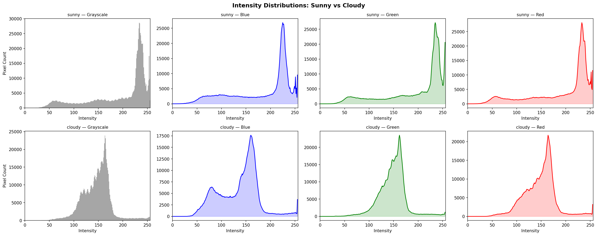

### Camera geometry

| Figure | File | What it shows |
|--------|------|---------------|
| Perspective illustration | `03_perspective_illustration.png` | The source frame annotated with "NEAR slots (large in pixels)" / "FAR slots (small in pixels)" and cyan converging vanishing lines. |
| Corner points | `04_corner_points.png` | The four correspondence points P1–P4 with a yellow quadrilateral connecting them. |
| BEV comparison | `04_bev_comparison.png` | **The money shot** — original perspective beside the warped bird's-eye view. |
| BEV validation | `04_bev_validation.png` | Left: sorted slot areas, original vs. BEV. Right: BEV area histogram with the mean marked. This is the figure that reveals the ratio did not improve. |
| All slots overlay | `05_all_slots_overlay.png` | All 100 polygons pushed through `H` and drawn on the BEV, colour-coded by ground truth. Confirms `perspectiveTransform` correctness. |

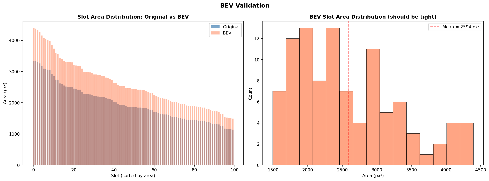

### ROI extraction

| Figure | File | What it shows |
|--------|------|---------------|
| Mask extraction | `06_mask_extraction.png` | Four panels: raw bounding-box patch → full polygon mask → eroded core mask → final masked ROI. |
| All ROIs | `07_all_rois.png` | All 100 bay outlines on the BEV with ID labels. |


### Preprocessing

| Figure | File | What it shows |
|--------|------|---------------|
| Preprocessing ladder | `08_preprocessing_ladder.png` | 2×5 grid — occupied bay (top) and vacant bay (bottom) through Original → Grayscale → Gaussian 5×5 → Median 3×3 → Global HE. |
| CLAHE histograms | `08_clahe_histograms.png` | Before/after CLAHE images plus overlaid histograms computed **only over masked slot pixels**. |
| Filter comparison | `08_filter_comparison.png` | Gaussian 3×3/5×5 vs. Median 3×3/5×5 on the same bay — the edge-preservation difference. |
| Sunny vs cloudy | `08_sunny_vs_cloudy.png` | The same 4 bays fully preprocessed under both conditions, showing CLAHE's normalising effect. |

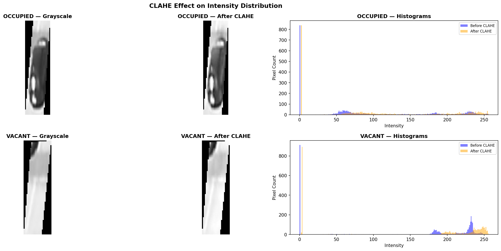

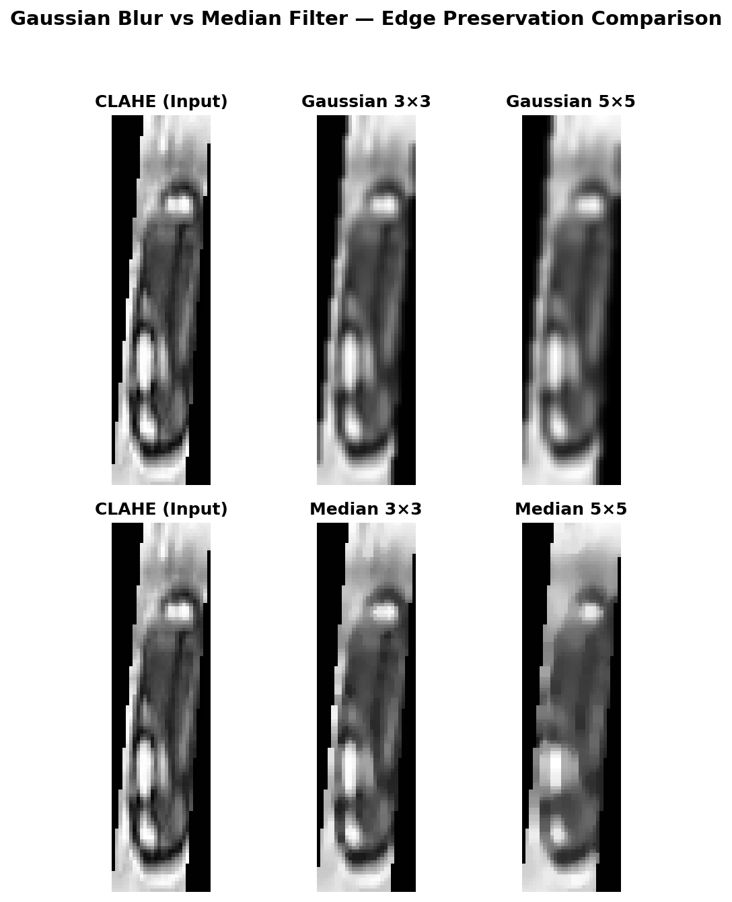

### Segmentation & morphology

| Figure | File | What it shows |
|--------|------|---------------|
| Thresholding comparison | `09_thresholding_compare.png` | 2×5 — occupied and vacant bays through Original / Global(127) / Adaptive(11,2) / Otsu(T) / Fused. |
| Shadow suppression | `09_shadow_suppression.png` | Original / Otsu-with-shadows / HSV shadow mask / after removal, for two bays. |
| Morphology stages | `10_morphology_stages.png` | 2×3 — original binary, erosion, dilation, opening, closing, full cleanup. |
| Full segmentation pipeline | `10_full_segmentation_pipeline.png` | 6 bays × 4 columns: original → preprocessed → fused binary → after morphology. |


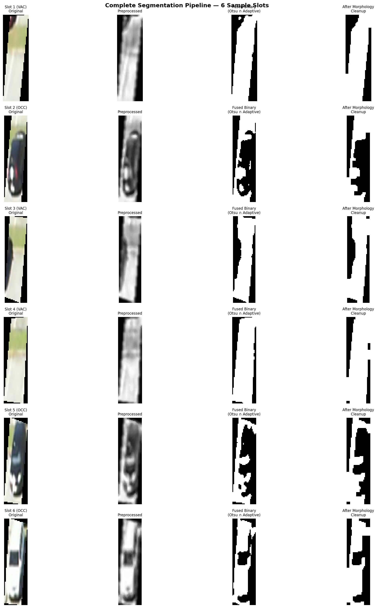

### Feature analysis

| Figure | File | What it shows |
|--------|------|---------------|
| Feature histograms | `11_feature_histograms.png` | 2×4 grid, one panel per feature, occupied (red) vs. vacant (green) density histograms. **The single most diagnostic figure in the project** — overlap here predicts classifier error. |
| Fisher ranking | `12_fisher_ranking.png` | Horizontal bar chart of all 8 Fisher ratios, sorted, with values annotated. |
| Canny edges | `12_canny_edges.png` | 3 occupied + 3 vacant bays with their Canny outputs and measured ρₑ. |
| Weather stability | `12_weather_stability.png` | Per-feature distributions split by weather — how much each feature drifts between conditions. |

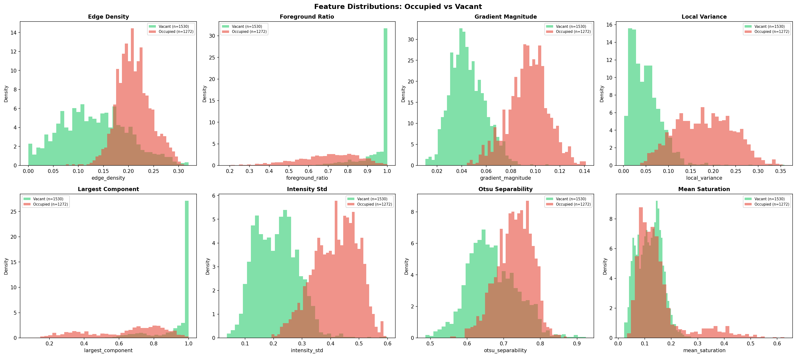

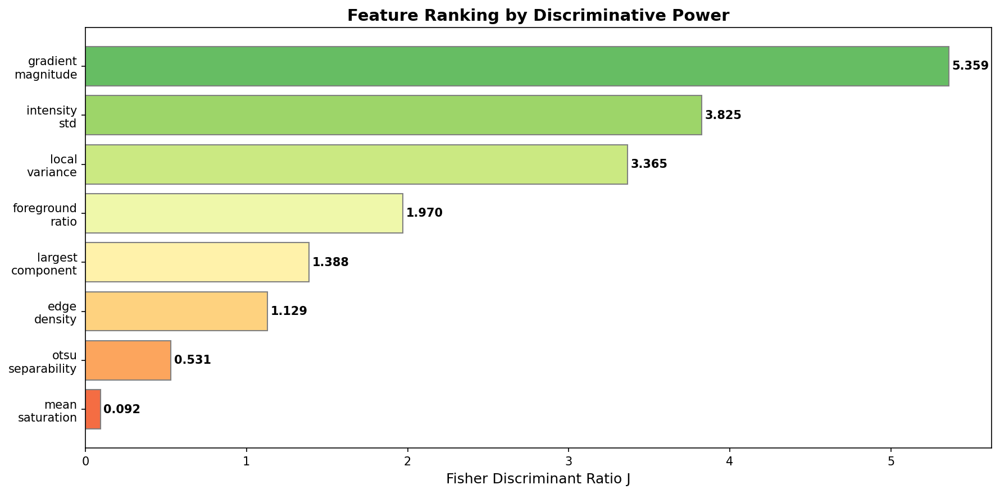

### Tuning & evaluation

| Figure | File | What it shows |
|--------|------|---------------|
| Threshold sweep | `13_threshold_sweep.png` | Left: accuracy/F1/precision/recall vs. edge-density threshold with both optima marked. Right: F1 zoomed near the optimum. |
| Confusion matrix | `14_confusion_matrix.png` | Seaborn heat map of the tuning-set confusion matrix with TP/FP/TN/FN annotations. |
| Pipeline result | `15_pipeline_result.png` | Full annotated BEV for the held-out test frame with the statistics banner. |
| Per-weather confusion | `16_overall_confusion.png` | Three confusion matrices side by side with per-weather accuracy and F1 in the titles. |
| Per-weather comparison | `17_per_weather_comparison.png` | Grouped bars — accuracy, precision, recall, F1 for each weather condition. |
| Timing breakdown | `18_timing_breakdown.png` | Horizontal bar chart of the 8 pipeline stages in milliseconds, FPS in the title. |

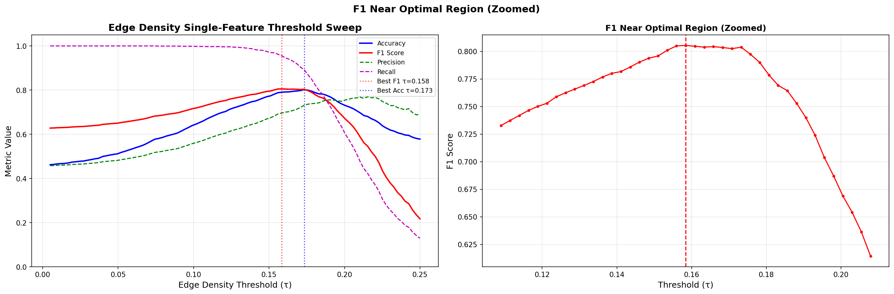

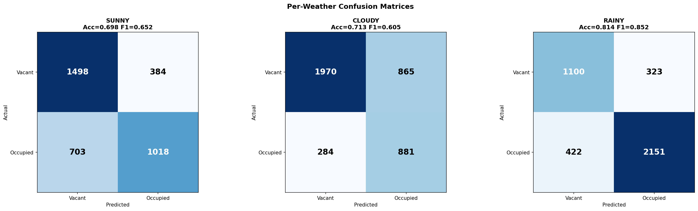

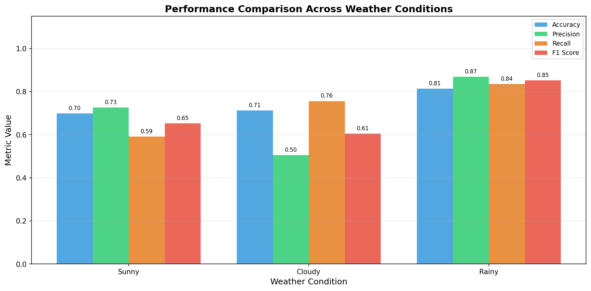

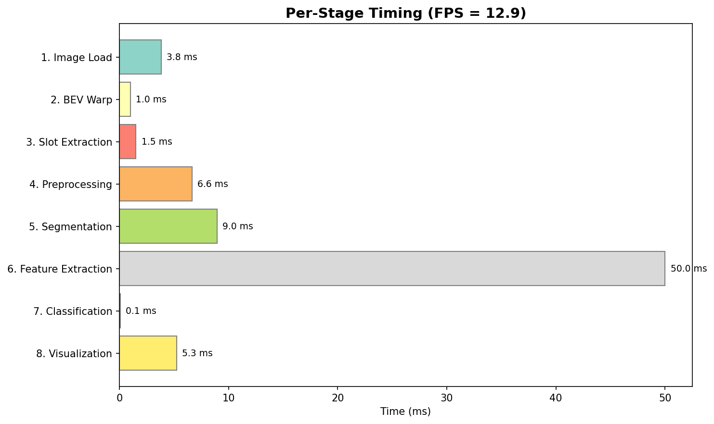

### Final results

| Figure | File | What it shows |
|--------|------|---------------|
| Results gallery | `19_results_gallery.png` | Three annotated frames (one per weather) with accuracy, F1 and occupancy in each title. |
| Sunny result | `outputs/annotated/sunny_result.png` | 800×1060 annotated BEV — 30.0 % predicted occupancy. |
| Cloudy result | `outputs/annotated/cloudy_result.png` | 800×1060 annotated BEV — 45.0 % predicted occupancy. |
| Rainy result | `outputs/annotated/rainy_result.png` | 800×1060 annotated BEV — 65.0 % predicted occupancy. |


<p align="center">
  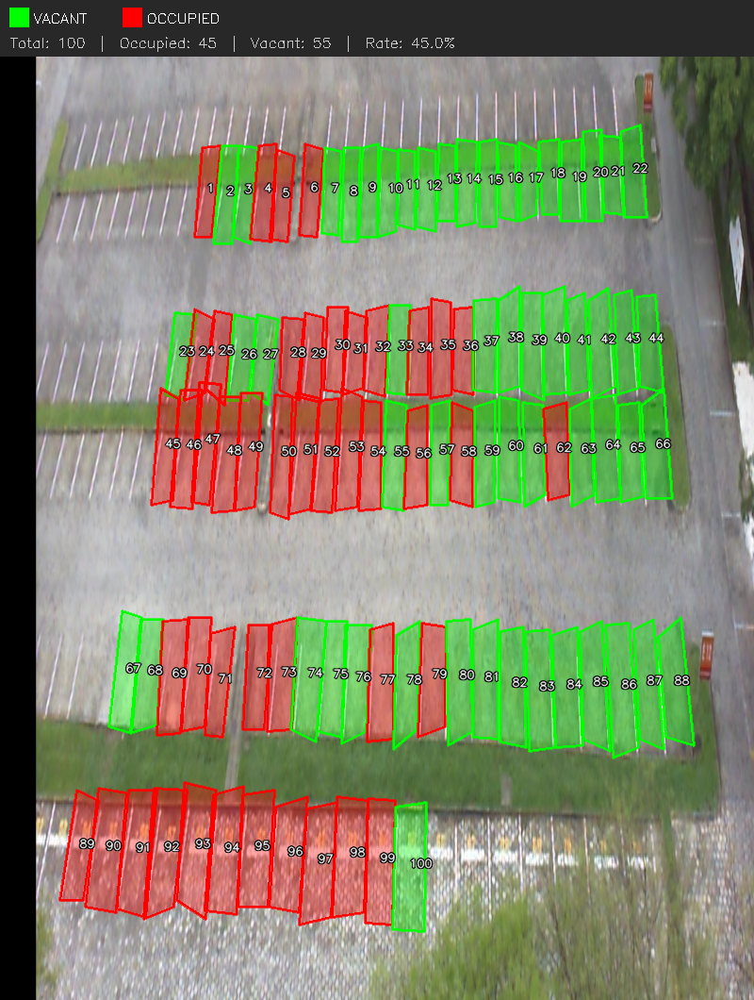
  
</p>

### Figures referenced but not saved

Two notebook cells display figures inline without persisting them, so they exist only inside the `.ipynb` files:

- **Weighted-score sweep** (Notebook 07) — the 8-feature threshold sweep curve
- **10 most error-prone slots** (Notebook 08) — image patches of the 10 worst-performing bays

Both calls pass `None` as the filename to `show_and_save_fig()`.

---
## 📊 Results

All numbers below are taken verbatim from the executed notebook outputs stored in this repository. Nothing is estimated or projected.

### Headline result

<table>
<tr>
<td align="center"><b>74.30 %</b><br><sub>Accuracy</sub></td>
<td align="center"><b>0.7204</b><br><sub>Precision</sub></td>
<td align="center"><b>0.7419</b><br><sub>Recall</sub></td>
<td align="center"><b>0.7310</b><br><sub>F1 Score</sub></td>
<td align="center"><b>12.9</b><br><sub>FPS</sub></td>
</tr>
</table>

**Evaluation protocol:** 120 frames (40 per weather condition, evenly spaced across the whole `parking2` dataset) → **11,599 individual slot classifications**.

### Occupied vs. vacant spaces

| Quantity | Count | Share |
|----------|------:|------:|
| Total slot samples evaluated | 11,599 | 100 % |
| Ground-truth **OCCUPIED** | 5,459 | 47.1 % |
| Ground-truth **VACANT** | 6,140 | 52.9 % |
| Predicted **OCCUPIED** | 5,622 | 48.5 % |
| Predicted **VACANT** | 5,977 | 51.5 % |

The predicted class distribution is close to the true one (48.5 % vs. 47.1 % occupied), so the classifier is **not** systematically biased toward one class — errors are roughly symmetric rather than a global offset.

### Confusion matrix (11,599 samples)

```
                        PREDICTED
                   VACANT      OCCUPIED
              ┌─────────────┬─────────────┐
      VACANT  │  TN = 4568  │  FP = 1572  │   6,140
 A            ├─────────────┼─────────────┤
 C  OCCUPIED  │  FN = 1409  │  TP = 4050  │   5,459
 T            └─────────────┴─────────────┘
 U               5,977         5,622        11,599
 A
 L
```

| Outcome | Count | Meaning |
|---------|------:|---------|
| **TP** — True Positive | 4,050 | Occupied bay correctly reported occupied |
| **TN** — True Negative | 4,568 | Vacant bay correctly reported vacant |
| **FP** — False Positive | 1,572 | Empty bay wrongly reported occupied → *a driver is sent away from a free space* |
| **FN** — False Negative | 1,409 | Occupied bay wrongly reported vacant → *a driver is sent to a taken space* |

FP and FN are nearly balanced (1,572 vs. 1,409), which is why precision (0.7204) and recall (0.7419) sit so close together.

### Occupancy percentage on demonstration frames

| Weather | Annotated output | Predicted occupancy |
|---------|------------------|--------------------:|
| ☀️ Sunny | `outputs/annotated/sunny_result.png` | **30.0 %** (30 / 100) |
| ☁️ Cloudy | `outputs/annotated/cloudy_result.png` | **45.0 %** (45 / 100) |
| 🌧️ Rainy | `outputs/annotated/rainy_result.png` | **65.0 %** (65 / 100) |

Held-out end-to-end test frame (Notebook 07): predicted **73 occupied / 27 vacant = 73.0 %**, with a per-frame accuracy of **0.6500** and F1 of **0.7826**.

### Per-weather performance (large-scale evaluation)

| Weather | Samples | Accuracy | F1 | TN | FP | FN | TP |
|---------|--------:|---------:|---:|---:|---:|---:|---:|
| ☀️ **Sunny** | 3,603 | 0.698 | 0.652 | 1,498 | 384 | 703 | 1,018 |
| ☁️ **Cloudy** | 4,000 | 0.713 | 0.605 | 1,970 | 865 | 284 | 881 |
| 🌧️ **Rainy** | 3,996 | **0.814** | **0.852** | 1,100 | 323 | 422 | 2,151 |

```
Accuracy by weather
  Rainy   ████████████████████████████████████████▏  0.814
  Cloudy  ███████████████████████████████████▋       0.713
  Sunny   ██████████████████████████████████▉        0.698

F1 by weather
  Rainy   ██████████████████████████████████████████▌ 0.852
  Sunny   ████████████████████████████████▌           0.652
  Cloudy  ██████████████████████████████▎             0.605
```

**Reading these numbers:**

- **Rainy performs best** (0.814 / 0.852) — counter-intuitive at first, but the rainy subset is heavily occupied (2,573 of 3,996 bays), and a heavily-loaded lot has fewer opportunities for false positives. Diffuse rainy lighting also eliminates the hard shadows that plague sunny frames.
- **Cloudy has the worst F1** (0.605) despite mid-range accuracy, driven by **865 false positives against only 1,165 truly-occupied bays** — precision collapses. Flat overcast lighting compresses the intensity range, so `intensity_std` and `local_variance` (jointly 40.7 % of the total weight) lose their discriminating power and empty asphalt starts scoring like a vehicle.
- **Sunny has the worst recall** — 703 false negatives. Hard shadows falling across bays alter the local statistics enough that genuinely occupied bays fall below the score threshold.

*(Notebook 07 reports slightly different per-weather figures — sunny 0.7469, cloudy 0.7290, rainy 0.8080 — because it evaluates on the 2,802-sample tuning set rather than the 11,599-sample evaluation set. Both are reported here for completeness; the 11,599-sample figures are the ones to cite.)*

### Tuning-set evaluation (2,802 samples, Notebook 07)

| Metric | Value |
|--------|------:|
| Accuracy | 0.7623 (76.2 %) |
| Precision | 0.7393 (73.9 %) |
| Recall | 0.7358 (73.6 %) |
| F1 Score | 0.7376 (73.8 %) |
| TP / FP / FN / TN | 936 / 330 / 336 / 1,200 |

Performance on the tuning set (76.2 %) is **2 points higher** than on the larger evaluation set (74.3 %) — a small, expected optimism gap from calibrating thresholds on that data.

### ⚠️ Method comparison — the negative result

This is the most important finding in the project, and it does not favour the design:

| Method | Threshold | Accuracy | F1 |
|--------|-----------|---------:|---:|
| **Single feature** — edge density alone | τ = 0.164 | **0.7885** | **0.8063** |
| **Multi-feature cascade** — 8 features + Fisher weights | as calibrated | 0.7430 | 0.7310 |
| **Difference** | | **−4.55 pts** | **−7.53 pts** |

**The 8-feature cascade is outperformed by a single thresholded feature.** Adding seven more features and Fisher-derived weights made the system measurably worse.

**Why this happens** — three compounding causes, all traceable to the measured data:

1. **Two features have inverted polarity.** The weighted score adds every feature *positively*, on the assumption that higher = more likely occupied. But the measured means show `foreground_ratio` is **0.9468 for vacant vs. 0.6976 for occupied**, and `largest_component` is **0.9285 vacant vs. 0.6336 occupied**. Both are *higher* for empty bays, because Otsu binarises uniform empty asphalt into one large white region. Together these two carry **19.0 % of the total weight**, actively pushing empty bays toward "occupied".
2. **Fisher ratios measure separation, not direction.** `J = (μ₁ − μ₀)² / (σ₁² + σ₀²)` squares the mean difference, so a strongly *inversely* correlated feature earns a **high** weight — exactly the wrong outcome for an additive score. `foreground_ratio` (J = 1.9695) ranks 4th of 8 precisely because it separates the classes well, in the wrong direction.
3. **The strongest feature is diluted.** Edge density, which alone reaches F1 0.8063, receives a weight of just **0.0639** — the 6th largest of eight. Its signal is averaged away by weaker and inverted terms.

**The fix is small and concrete:** flip the sign of the two inverted features (use `1 − foreground_ratio` and `1 − largest_component`) or derive weights from a *signed* statistic such as the point-biserial correlation instead of the squared Fisher ratio. This is documented in [Future Improvements](#-future-improvements). It was identified through the ablation study but not applied in the current results, which are reported as measured.

### Error analysis — the 10 worst bays

| Slot ID | Accuracy | Correct / Total |
|--------:|---------:|----------------:|
| 96 | 19.8 % | 23 / 116 |
| 97 | 25.9 % | 30 / 116 |
| 98 | 35.3 % | 41 / 116 |
| 99 | 35.3 % | 41 / 116 |
| 92 | 40.3 % | 48 / 119 |
| 93 | 42.2 % | 49 / 116 |
| 89 | 43.1 % | 50 / 116 |
| 94 | 43.1 % | 50 / 116 |
| 95 | 45.7 % | 53 / 116 |
| 100 | 49.1 % | 57 / 116 |

**Nine of the ten worst bays are IDs 89–100 — the entire bottom row.** Slot 96 is correct only 19.8 % of the time, which is *worse than random guessing* and indicates a systematic sign flip for that bay, not noise.

This clustering is visible in the annotated outputs: in `outputs/annotated/sunny_result.png`, bays 89–100 are almost all rendered green (predicted vacant) even where vehicles are present. The bottom row sits at the far edge of the warped image where it is partially cropped by the border, receives the least favourable warp, and — because the homography is a pure scale rather than a true rectification — is the region whose geometry is least well normalised. **This is a geometry problem surfacing as a classification problem.**

### Performance benchmark

Mean per-frame timing over 10 frames, each with 100 bays (Notebook 08):

| # | Stage | Time (ms) | Share |
|---|-------|----------:|------:|
| 1 | Image Load | 3.84 | 5.0 % |
| 2 | BEV Warp | 1.01 | 1.3 % |
| 3 | Slot Extraction | 1.52 | 2.0 % |
| 4 | Preprocessing | 6.65 | 8.6 % |
| 5 | Segmentation | 8.96 | 11.6 % |
| 6 | **Feature Extraction** | **50.01** | **64.7 %** |
| 7 | Classification | 0.09 | 0.1 % |
| 8 | Visualization | 5.26 | 6.8 % |
| | **TOTAL** | **77.33** | **100 %** |
| | **Throughput** | **12.9 FPS** | |

```
Feature Extraction  ██████████████████████████████████████████████████████  50.01 ms
Segmentation        █████████▊                                               8.96 ms
Preprocessing       ███████▎                                                 6.65 ms
Visualization       █████▊                                                   5.26 ms
Image Load          ████▏                                                    3.84 ms
Slot Extraction     █▋                                                       1.52 ms
BEV Warp            █                                                        1.01 ms
Classification      ▏                                                        0.09 ms
```

**Interpretation:**

- **Feature extraction dominates at 64.7 %** — 0.5 ms per bay × 100 bays. The likely culprit is `compute_otsu_separability()`, which runs a **256-iteration pure-Python loop** per bay to find the optimal threshold. That is ~25,600 Python-level iterations per frame. Vectorising it with NumPy cumulative sums would be the single highest-value optimisation available.
- **Classification is essentially free** at 0.09 ms — 0.1 % of the budget. All the cost is in *producing* the features, none in *using* them.
- **The geometry stage is nearly free** at 1.01 ms, despite warping a full 1280×720 frame. `cv2.warpPerspective` is heavily optimised.
- **12.9 FPS on CPU with no GPU** is well above what a parking application needs — occupancy changes on a timescale of minutes, so even 1 frame every 10 seconds would be ample. The headroom means one machine could serve many camera feeds.

### Summary of what was measured

| Measurement | Value |
|-------------|-------|
| Dataset frames indexed | 12,416 across 3 lots |
| Primary lot | `parking2` — 4,473 frames |
| Parking bays calibrated | 100 |
| Ground-truth rows exported | 42,318 (448 frames) |
| Feature vectors extracted | 2,802 (30 frames) |
| Slot classifications evaluated | **11,599** (120 frames) |
| Best single-feature F1 | 0.8063 (edge density, τ = 0.164) |
| Cascade F1 | 0.7310 |
| Cascade accuracy | 0.7430 |
| Best weather (F1) | Rainy — 0.852 |
| Worst weather (F1) | Cloudy — 0.605 |
| Per-frame latency | 77.33 ms |
| Throughput | 12.9 FPS |

---

## 🌟 Project Highlights

### 1. Every claim is backed by a measurement

There are no unsourced numbers in this project. The Fisher ratios come from 2,802 labelled samples, the thresholds from 100-point sweeps, the accuracy from 11,599 classifications, and the FPS from an instrumented 8-stage benchmark. Where a documentation comment disagrees with a measurement, **this README reports the measurement** and flags the discrepancy.

### 2. The negative results are reported, not buried

Three findings work against the project's original design, and all three are documented with their numbers:

- The 8-feature cascade **loses** to single-feature edge density by 4.5 accuracy points
- The homography is degenerate — the BEV area ratio stayed at 2.9× instead of improving
- Edge density, hypothesised as "the single strongest discriminator", ranks **6th of 8**

A project that only reports what worked has not actually been evaluated. Each of these has a diagnosed cause and a concrete proposed fix.

### 3. Clean three-layer separation

```
src/  (library)  ←  imported by  ←  notebooks/  (experiments)
                                         │
                                         ▼
                                    config/  (artifacts)
```

No algorithm is defined inside a notebook. No notebook duplicates logic. The calibration pipeline runs once and emits three small config files, after which inference needs neither the notebooks nor the 3.9 GB dataset.

### 4. Genuinely dependency-light

`opencv-python`, `numpy`, `matplotlib`, `pandas`, `PyYAML` and `seaborn` — that is the entire runtime surface. Confusion matrices, precision, recall, F1 and the Fisher ratio are all implemented from scratch in NumPy. No `sklearn`, no deep-learning framework, no pretrained weights, no GPU, and no network access at inference time.

### 5. Every stage is inspectable and every parameter explicable

`preprocess_ladder()` and `morphology_grid()` exist purely to return **all intermediate stages** for visualisation. When a bay is misclassified you can look at its grayscale, its blur, its CLAHE output, its binary mask, its morphology stages, its Canny edges and its 8 feature values — and identify exactly which one failed. There is no equivalent of this for a neural network's misclassification.

### 6. Physically-grounded parameter choices

Several parameters are derived from physical quantities rather than picked by eye:

- Erosion radius from metres: `erosion_px = max(2, int(0.15 × px_per_m))` ≈ 15 cm
- Scale estimated from real bay dimensions: 14.4 px/m, from mean BEV area assuming 2.5 m × 5.0 m bays
- Feature normalisation from `uint8` theoretical bounds: `Var_max = (255/2)² = 16256.25`, `σ_max = 127.5`, Sobel max `√2·255·4`

### 7. Rigorous evaluation methodology

- **Per-weather stratification** — 40 frames from each condition, so the aggregate is not dominated by the largest subset
- **Class balance always reported** alongside accuracy, because 74 % accuracy means something different on balanced vs. skewed data
- **Ablation study** comparing single-feature against multi-feature
- **Per-slot error tracking** that revealed the spatial clustering in bays 89–100
- **Stage-level profiling** rather than a single end-to-end timing number

### 8. Reproducible by construction

Every stage is deterministic — no stochastic component exists anywhere in the pipeline. `np.random.seed(42)` is set where sampling occurs. Given identical inputs and config files, every run reproduces byte-identical outputs. The paired jupytext `.py` files make the notebooks reviewable in a normal code diff.

### 9. Substantial documentation inside the code

Every module opens with a docstring containing the relevant **theory**: `geometry.py` derives the homography from the pinhole model, `morphology.py` gives the set-theoretic definitions of erosion and dilation, `segmentation.py` states Otsu's between-class variance objective, `features.py` tabulates the physical signal each feature captures, and `evaluate.py` explains why accuracy alone is misleading. Roughly 40 % of the ~4,100 lines in `src/` are documentation.

---

## 🧗 Challenges Faced

Each challenge below is described with the evidence that revealed it, and the current status.

### 1. Perspective distortion — and a homography that did not fix it

**The problem.** Bays near the camera occupy 3,350 px² while distant bays occupy 1,138 px² — a **2.9× ratio**. A single edge-density threshold cannot serve both.

**What was attempted.** Compute a homography from four correspondences and warp to a bird's-eye view where all bays have comparable area.

**What happened.** The source points were derived automatically from the **axis-aligned bounding box** of all slot polygons. Mapping a rectangle to a rectangle can only produce an affine transform, and the resulting matrix confirms it:

```
h12 ≈ -4.2e-19    h21 ≈ -7.4e-19     ← rotation/shear terms are zero
h31 ≈ -2.5e-20    h32 ≈ -7.0e-38     ← projective terms are zero

⟹  x' = 0.6066·x + 38.16     (uniform horizontal scale)
    y' = 2.1634·y − 305.87   (uniform vertical scale)
```

Measured outcome: the area ratio was **2.9× before and 2.9× after**. Everything scaled by a constant, so relative differences were preserved exactly.

**Status.** ⚠️ **Unresolved.** The fix requires four *genuinely coplanar ground features* — for example, the corners of a rectangular lane-marking region — rather than a bounding box. This is the most likely single cause of the bays 89–100 failure cluster, and is the highest-priority item in [Future Improvements](#-future-improvements).

### 2. Lighting variation across weather conditions

**The problem.** Sunny frames have high contrast and saturated colour; cloudy frames compress the dynamic range; rainy frames are dark with specular reflections. A pipeline tuned on one condition fails on the others.

**What was done.** CLAHE with `clipLimit=2.0` and 8×8 tiles, applied per bay. The clip limit specifically prevents the near-uniform histogram of empty asphalt from being stretched into amplified noise.

**Measured outcome.** Partially successful. Accuracy holds within a 12-point band (69.8 % – 81.4 %) across conditions, but **cloudy F1 collapses to 0.605** with 865 false positives. Flat overcast lighting flattens `intensity_std` and `local_variance` — jointly 40.7 % of the total weight — so empty asphalt starts scoring like a vehicle.

**Status.** ⚠️ **Partially mitigated.** Weather-conditional thresholds are proposed in Future Improvements.

### 3. Shadows

**The problem.** In sunny frames, hard shadows cross bay boundaries. In grayscale a shadow edge is indistinguishable from dark vehicle paint, and it introduces both spurious edges and genuine intensity variance.

**What was done.** `shadow_suppress_hsv()` was implemented on sound physical reasoning: a shadow **attenuates brightness (V drops) while preserving hue (H stable)** and reduces saturation, whereas a vehicle changes hue and saturation. The function flags `v_low ≤ V ≤ v_high AND S ≤ s_threshold` as shadow.

**Measured outcome.** Demonstrated visually in `09_shadow_suppression.png`, and sunny frames do show the worst recall in the evaluation (703 false negatives).

**Status.** ⚠️ **Implemented but not integrated.** `ParkingPipeline.process_frame()` imports the function but never calls it, and neither do the notebook evaluation loops. Its effect on the headline metrics is therefore **unmeasured** — it cannot be credited with any of the reported performance.

### 4. Threshold selection

**The problem.** Where exactly does "empty" become "occupied"? Guessed thresholds are indefensible and fragile.

**What was done.** Replaced guessing with measurement: a 100-point sweep over edge density recording all four metrics, a 100-point sweep over the weighted score, and percentile-derived fast-path bounds (97th percentile of vacant for τ_high, 3rd percentile of occupied for τ_low).

**Measured outcome.** ✅ **Successful.** Edge density peaks at F1 0.8054 (τ = 0.1584) with a broad, flat optimum — meaning the choice is not knife-edge sensitive. The tuning-vs-evaluation gap is only 2 points (76.2 % → 74.3 %), indicating the thresholds generalise reasonably.

### 5. ROI alignment and neighbour bleed

**The problem.** Vehicles have height. Even in a rectified view, a tall SUV's roof projects into neighbouring bays. A bounding box around an angled bay is up to ~40 % foreign pixels.

**What was done.** Three-tier masking — bounding box for fast slicing, polygon mask for correctness, eroded core mask (−3 px) to exclude painted lane lines and boundary overhang.

**Measured outcome.** ✅ **Successful.** Notebook 04's histogram cell demonstrates the failure mode this prevents: without masking, zero-padded corners create a huge spike at intensity 0 that flattens the entire distribution.

### 6. The multi-feature score performed worse than one feature

**The problem.** Adding seven features to edge density **degraded** accuracy by 4.5 points and F1 by 7.5 points.

**Diagnosis** (from the measured feature statistics):

| Feature | Occupied mean | Vacant mean | Direction | Weight |
|---------|-------------:|-----------:|-----------|-------:|
| `foreground_ratio` | 0.6976 | **0.9468** | ❌ Inverted | 0.1115 |
| `largest_component` | 0.6336 | **0.9285** | ❌ Inverted | 0.0786 |

Both features score **higher on empty bays**, because Otsu binarises uniform asphalt into one large white region. The weighted score adds every term positively, so **19.0 % of the total weight actively pushes empty bays toward "occupied"**. And because the Fisher ratio *squares* the mean difference, it cannot distinguish "strongly correlated" from "strongly anti-correlated" — it assigned these inverted features substantial weight precisely because they separate the classes well, in the wrong direction.

**Status.** ⚠️ **Diagnosed, not fixed.** The remedy is a two-line change (invert the two features, or switch to a signed weighting statistic). The results in this README are reported as measured, without that fix applied.

### 7. Channel fusion that does not fuse

**The problem.** `fuse_channels()` is designed to combine Otsu and adaptive thresholding via a weighted soft vote at 0.5. With no reference channel, the weights renormalise to 0.571 / 0.429.

**The consequence.** Since **0.571 > 0.5**, the Otsu channel alone always crosses the threshold; since **0.429 < 0.5**, the adaptive channel alone never does. Verified empirically on random inputs: `fused == otsu_binary` is **exactly true**. The adaptive threshold is computed on every bay — contributing to the 11.6 % segmentation cost — but has **zero effect on the output**.

Several figure titles label this panel "Otsu ∩ Adaptive", which does not describe the implemented logic (a true intersection would be `otsu & adaptive`).

**Status.** ⚠️ **Identified.** Fixable either by lowering the fusion cut-off below 0.429 so both channels can contribute, or by replacing the soft vote with an explicit AND/OR.

### 8. Otsu's bimodality assumption on empty bays

**The problem.** Otsu assumes a two-peaked intensity histogram. Empty asphalt is unimodal, so Otsu is forced to split a single mode arbitrarily, producing a large meaningless white region.

**What was done.** Applied Otsu **per bay** rather than per frame, where the assumption holds far better; and captured the separability η as a feature so the algorithm's own confidence becomes an input.

**Measured outcome.** ⚠️ **Partially effective.** η does differ between classes (0.7292 occupied vs. 0.6690 vacant) but weakly — Fisher J = 0.5310, ranking 7th of 8. More importantly, this unresolved issue is the root cause of the inverted `foreground_ratio` and `largest_component` features in challenge 6.

### 9. Systematic failure in the far row

**The problem.** Per-slot error tracking showed nine of the ten worst bays are IDs 89–100, with slot 96 correct only 19.8 % of the time — worse than chance.

**Diagnosis.** Bay 96 performing below random is a signature of a **consistent sign flip**, not noise. The bottom row sits at the far edge of the warped image, is partially cropped by the border, and — because the homography is a pure scale rather than a true rectification (challenge 1) — is the region whose geometry is least well normalised.

**Status.** ⚠️ **Identified, root cause traced to challenge 1.** Fixing the homography is the prerequisite for fixing this.

### 10. Performance bottleneck in feature extraction

**The problem.** Feature extraction consumes **50.01 ms of 77.33 ms (64.7 %)** per frame — more than preprocessing, segmentation, warping and rendering combined.

**Diagnosis.** `compute_otsu_separability()` runs a **256-iteration pure-Python loop** for every bay to find the optimal threshold. At 100 bays that is ~25,600 interpreted iterations per frame, and this feature contributes only J = 0.5310 (7th of 8) with a weight of 0.0301.

**Status.** ⚠️ **Identified.** Two clear options: vectorise the loop with NumPy cumulative sums, or drop the feature entirely given its marginal contribution. Either would give a large speedup at negligible accuracy cost.

### 11. Documentation drifting from implementation

Building across many sessions, several docstrings and markdown cells fell out of sync with the code. All are catalogued here rather than silently corrected:

| Location | Documentation says | Code actually does |
|----------|-------------------|--------------------|
| Notebook 04 markdown table | Grayscale → CLAHE → Blur → Median | Grayscale → Gaussian → Median → CLAHE |
| Notebook 01 markdown | Slot areas vary "up to 8x" | Measured **2.9×** |
| Notebook 02 summary | BEV reduces ratio "~8x → ~2x" | Measured **2.9× → 2.9×** |
| Figure titles (NB 05) | "Fused (Otsu ∩ Adaptive)" | Weighted soft vote; result equals Otsu alone |
| `features.py` docstring | "Edge density is the single strongest discriminator" | Ranks **6th of 8** (J = 1.1292) |
| `decide.py` `DEFAULT_WEIGHTS` | `edge_density` weighted highest at 0.30 | Tuned weight is **0.0639** |
| `evaluate.py` docstring | Lists `measure_processing_time()`, `evaluate_by_weather()`, `method_comparison()` | **None of these three are defined** |
| `config.yaml` `perspective.output_size` | `[600, 800]` | Notebook 02 hard-codes 800×1000 |
| `config.yaml` `decision.*` | Four vote-counting thresholds | Superseded by `thresholds.yaml`; unused |

**Status.** ✅ **Catalogued.** Every discrepancy is flagged at its point of use in this README, and in each case the **measured or executed behaviour** is what is reported.

### 12. Dataset scale and repository hygiene

**The problem.** The dataset is 7.5 GB (3.6 GB archive + 3.9 GB extracted) and the virtual environment adds 752 MB. The repository currently has **no `.gitignore`** and **zero commits**.

**What was done.** `curate_samples()` extracts 21 representative frames into `data/samples/` so development can proceed without touching the full dataset; `labels.csv` is built from every 10th frame rather than all 4,473.

**Status.** ⚠️ **Partially addressed.** A `.gitignore` excluding `venv/`, `data/raw/` and `__pycache__/` is needed before the first commit — see [Installation Step 8](#step-8--recommended-repository-hygiene). Without it, `git add .` would attempt to commit 8.2 GB.

---
## 🚀 Future Improvements

Ordered by expected impact per unit of effort. The first four address problems **measured in this repository**, so their value is not speculative.

### Priority 1 — Fix the two inverted features 🔴

**Problem measured:** `foreground_ratio` (0.9468 vacant vs. 0.6976 occupied) and `largest_component` (0.9285 vs. 0.6336) both score *higher* on empty bays, yet contribute **19.0 % of the weight positively** to the occupancy score.

**Fix:**

```python
# In features.extract_all_features(), invert the two anti-correlated features
features['foreground_ratio']  = 1.0 - foreground_ratio
features['largest_component'] = 1.0 - largest_comp
```

Or, more robustly, replace the Fisher ratio with a **signed** statistic when deriving weights:

```python
# Point-biserial correlation preserves direction; Fisher's squared numerator does not
r = (mu_occ - mu_vac) / pooled_std * sqrt(n_occ * n_vac / n**2)
weight = abs(r); sign = np.sign(r)
```

**Expected impact:** should close most of the 4.5-point gap to the single-feature baseline. **Effort:** ~10 lines.

### Priority 2 — Recompute the homography from true ground correspondences 🔴

**Problem measured:** the current `H` is a pure anisotropic scale (`h12 ≈ h21 ≈ h31 ≈ h32 ≈ 0`); the BEV slot-area ratio stayed at **2.9× → 2.9×**.

**Fix:** replace the bounding-box-derived source points with four **genuinely coplanar ground features** — the corners of a rectangular lane-marking region, or the outer corners of a known parking row. Validate by checking that lines known to be parallel in the world become parallel in the BEV, and that `h31`/`h32` are non-zero.

```python
src_points = np.float32([[...], [...], [...], [...]])   # 4 coplanar ground points
dst_points = np.float32([[0,0], [W,0], [W,H], [0,H]])   # true metric rectangle
H, _ = cv2.findHomography(src_points, dst_points, cv2.RANSAC)
assert abs(H[2,0]) > 1e-6 or abs(H[2,1]) > 1e-6, "still degenerate — points are collinear/rectangular"
```

**Expected impact:** likely fixes the bays 89–100 failure cluster (nine of the ten worst bays) and delivers the promised area normalisation. **Effort:** one afternoon of point selection plus re-running Notebooks 02–08.

### Priority 3 — Integrate HSV shadow suppression 🟠

**Problem measured:** sunny frames have the worst recall (703 false negatives). `shadow_suppress_hsv()` is implemented but **never called** in the pipeline.

**Fix:** wire it into `ParkingPipeline.process_frame()` between segmentation and morphology, then re-run the ablation to measure its actual contribution:

```python
otsu_binary, _, _ = otsu_threshold(preprocessed)
adapt_binary      = adaptive_threshold(preprocessed)
fused             = fuse_channels(otsu_binary, adapt_binary)

_, non_shadow = shadow_suppress_hsv(slot_img, v_low=80, s_threshold=60)
fused         = cv2.bitwise_and(fused, non_shadow)      # ← add this

cleaned = clean_binary_mask(fused)
```

**Expected impact:** unknown until measured — which is exactly why it should be measured. **Effort:** 2 lines plus a re-run.

### Priority 4 — Repair or replace the channel fusion 🟠

**Problem measured:** `fuse_channels()` output is **exactly equal to the Otsu mask**; the adaptive channel is computed but discarded.

**Fix — option A** (let both channels matter): lower the decision cut-off below the smaller normalised weight.

```python
fused = (combined > 0.35).astype(np.uint8) * 255   # 0.429 now clears the bar
```

**Fix — option B** (make the intent explicit, matching the figure captions):

```python
fused = cv2.bitwise_and(otsu_binary, adaptive_binary)   # true intersection
```

**Expected impact:** either recovers value from an already-paid computation, or justifies deleting the adaptive branch and reclaiming ~11 % of frame time. **Effort:** 1 line.

### Priority 5 — Vectorise the Otsu separability loop 🟡

**Problem measured:** feature extraction is **64.7 %** of frame time; `compute_otsu_separability()` runs a 256-iteration Python loop per bay (~25,600 iterations/frame) for a feature ranking 7th of 8.

**Fix:**

```python
p       = hist / hist.sum()
omega   = np.cumsum(p)
mu      = np.cumsum(np.arange(256) * p)
mu_t    = mu[-1]
sigma_b = (mu_t * omega - mu) ** 2 / (omega * (1 - omega) + 1e-12)
separability = np.nanmax(sigma_b) / sigma_total_sq
```

**Expected impact:** a large share of the 50 ms feature budget, likely pushing well past 20 FPS. **Effort:** ~8 lines.

### Video and real-time support

The dataset is still frames; there is no video handling in the codebase.

```python
cap = cv2.VideoCapture('parking_feed.mp4')      # or an RTSP URL / camera index
pipeline = ParkingPipeline('config/')
while cap.isOpened():
    ok, frame = cap.read()
    if not ok: break
    result = pipeline.process_frame(frame)
    cv2.imshow('Occupancy', result['annotated'])
```

At 12.9 FPS this already runs comfortably in real time, and occupancy only changes on a timescale of minutes — so sampling one frame every few seconds would be ample.

### Temporal hysteresis (already implemented, needs wiring)

`decide.apply_hysteresis()` exists and requires `m` consecutive agreeing frames before a bay flips state — the standard defence against flicker from passing clouds, pedestrians and birds. It is currently **never called** because the pipeline processes each frame independently.

```python
state = {}
for frame in video_frames:
    labels = pipeline.process_frame(frame)['labels']
    state, confirmed = apply_hysteresis(labels, state, m=3)
```

### Spatial neighbour refinement (already implemented, needs wiring)

`decide.neighbour_refinement()` flips low-confidence bays that disagree with all their neighbours. Also implemented, also never called. It would be a natural complement to per-slot error analysis, given that errors cluster spatially.

### Reference-image background subtraction

`segmentation.reference_difference()` is implemented but unused because no empty-lot reference exists for `parking2`. The docstring correctly prescribes a **median over many empty-lot frames** rather than a single frame. Building one would activate the third fusion channel and, per the module docstring, is the gold standard for change detection.

### Automatic ROI detection

Slot polygons currently come from PKLot's XML annotations. A new camera would need manual annotation. Classical alternatives:

- Hough line transform (`cv2.HoughLinesP`) to detect painted bay dividers, then infer the polygons between them
- Temporal median over hundreds of frames to synthesise an empty-lot image, then detect markings on it
- A one-time interactive click-to-annotate tool using OpenCV mouse callbacks

### Weather-adaptive thresholds

Cloudy F1 (0.605) trails rainy (0.852) by a wide margin. Rather than one global threshold set, classify the frame's global illumination first (mean brightness, histogram spread, saturation statistics) and load a per-condition threshold profile:

```yaml
thresholds:
  sunny:  { score_threshold: 0.31, edge_density_high: 0.28 }
  cloudy: { score_threshold: 0.26, edge_density_high: 0.24 }
  rainy:  { score_threshold: 0.29, edge_density_high: 0.27 }
```

The infrastructure already exists — `load_thresholds()` reads a YAML dictionary; it would only need a per-weather key.

### Multi-lot generalisation

Only `parking2` is calibrated. `parking1a` (3,791 frames) and `parking1b` (4,152 frames) are downloaded but unused. Running the same calibration on all three would test how much of the pipeline is lot-specific versus general — a genuinely interesting experiment with data already on disk.

### Testing and CI

There are currently **no unit tests** and no CI configuration. High-value candidates:

```python
def test_homography_roundtrip():
    """Points pushed through H then H⁻¹ must return to their origin."""

def test_fuse_channels_uses_both_inputs():
    """Regression test for the fusion bug documented above."""

def test_feature_normalisation_bounds():
    """All 8 features must lie in [0, 1] for any valid input."""

def test_confusion_matrix_against_known_case():
    """Hand-computed TP/FP/TN/FN for a small fixed array."""
```

### IoT, mobile and dashboard integration

Not implemented — listed as a genuine extension, not an existing feature. `outputs/dashboard/` is an empty reserved directory. A natural progression would be: publish `result['stats']` to MQTT → store a time series → serve a small web dashboard or mobile view.

### Hybrid classical + learned methods

Outside this project's constraints, but the honest next step: the 8 extracted features are exactly the input a small decision tree or logistic regression would want. Given that the current failure is an unsigned additive combination, even a linear model with *learned signs* would likely resolve the inverted-feature problem immediately — which is itself an instructive illustration of what a learned weighting buys you over a hand-derived one.

---

## 🏢 Applications

The same pipeline generalises to any fixed-camera, fixed-layout occupancy problem. Each application below notes what would need to change.

### 🛍️ Shopping malls

Large surface lots with high turnover. Real-time "level 2: 47 spaces free" signage cuts search traffic at the entrance and reduces congestion inside. Multiple cameras would each need their own `homography.npz` and `slots.json`; thresholds could be shared if the lots have similar surfaces.

### 🏥 Hospitals

Emergency-bay and ambulance-space monitoring where a wrong answer has real consequences. This favours a **precision-weighted** operating point — the threshold sweep in Notebook 07 already produces the full precision/recall curve, so shifting the operating point to minimise false "space available" reports is a config change, not a redesign.

### 🎓 Universities

The dataset's own origin — PKLot was collected on the UFPR campus. Campus lots have strong daily and semester cycles, so aggregated occupancy data supports permit allocation and shuttle scheduling. The 12.9 FPS throughput means a single machine could cover a whole campus.

### ✈️ Airports

Long-stay lots where occupancy changes slowly. A frame every few minutes is plenty, so the compute cost is negligible. Weather robustness matters here since these lots are typically uncovered — and the per-weather evaluation in this project is directly relevant.

### 🏙️ Smart cities

On-street parking monitoring from existing traffic cameras, feeding a municipal open-data API. The strongest argument for the classical approach in this setting is **auditability**: a public authority can inspect exactly why a space was reported occupied, which is far harder with a learned model.

### 🏭 Industrial and logistics yards

Truck and trailer bays, container slots. Larger vehicles produce stronger feature signals than cars, so discrimination should be easier — though bay polygons would need re-annotation for the different footprint.

### 🏘️ Residential complexes

Assigned-bay compliance and visitor-space availability. Low turnover means temporal hysteresis (`apply_hysteresis()`, already implemented) would be particularly effective, and the low frame rate keeps hardware costs minimal.

### 🎪 Event and stadium parking

Extreme surge conditions where knowing which sections are filling drives active traffic direction. The per-row breakdown already produced by `stats.per_row_breakdown()` maps directly onto "section" reporting.

### Transferring to a new site

| Step | What is needed | Effort |
|------|---------------|--------|
| 1 | Mount a fixed camera with a clear view of the bays | Site work |
| 2 | Select 4 coplanar ground correspondences → `homography.npz` | ~30 min |
| 3 | Annotate bay polygons once → `slots.json` | ~1 hr for 100 bays |
| 4 | Collect a labelled sample and re-run the threshold sweep → `thresholds.yaml` | ~2 hrs |
| 5 | Deploy — inference needs only `src/` plus the three config files | Minutes |

No retraining, no GPU, no labelled dataset of thousands of images. Steps 2–4 are a one-time calibration per camera.

---

## 🎓 Learning Outcomes

What this project taught, organised by topic.

### Camera geometry and projective transformation

- The **pinhole camera model** `s·x = K[R|t]·X` and how a planar scene (`Z = 0`) collapses the 3×4 projection into a 3×3 homography
- **Degrees of freedom**: `H` has 8 DOF (9 entries minus scale), hence a minimum of 4 point correspondences
- The **Direct Linear Transform** — each correspondence yields 2 linear equations; 4 pairs give an exact solution, more give least-squares or RANSAC
- **Forward vs. inverse mapping** — why `warpPerspective` samples backwards from the output grid to avoid holes
- **Reading a matrix diagnostically** — recognising from `h12 ≈ h21 ≈ h31 ≈ h32 ≈ 0` that a "homography" has degenerated into an affine scale. This single skill is what turned a silent failure into a diagnosed one.
- **Correspondences determine everything** — an automated but geometrically degenerate point selection produces a mathematically valid, practically useless transform

### Spatial filtering and enhancement

- **Linear vs. non-linear filtering** — convolution (Gaussian) versus rank-order (median), and why only the latter removes impulse noise without blurring edges
- **Separability** — a 2D Gaussian factorises into two 1D passes, turning `O(N²)` into `O(2N)`
- **Filter ordering matters** — Gaussian for general smoothing, then median for residual impulses; reversing them wastes the median's edge preservation
- **Histogram equalisation and its limits** — why one global transfer function cannot serve a scene with simultaneous sun and shadow
- **CLAHE mechanics** — tiling, per-tile equalisation, bilinear boundary interpolation, and the critical role of clip limiting in preventing noise amplification in flat regions
- **Histograms as a diagnostic** — bimodality justifies Otsu; a compressed range justifies CLAHE. Also: **mask before you histogram**, or zero-padding will dominate the distribution

### Segmentation

- **Otsu's method** — maximising between-class variance `σ²_B = ω₀ω₁(μ₀−μ₁)²`, and the equivalence to minimising within-class variance
- **Assumption checking** — Otsu needs bimodality; applying it per-ROI rather than per-frame is what makes the assumption approximately hold
- **Adaptive thresholding** — per-pixel thresholds from local Gaussian-weighted means, and why that survives partial shadow
- **Extracting free information** — separability η falls out of the same statistics Otsu already computes
- **Colour spaces as tools** — HSV separates illumination (V) from chromaticity (H, S), which is precisely the decomposition shadow detection needs
- **Verify your combination logic** — the fusion bug in this project is a reminder that a weighted vote with the wrong cut-off silently degrades to a single channel

### Morphology

- The **set-theoretic definitions** of erosion (`B_z ⊆ A`) and dilation (`B_z ∩ A ≠ ∅`), and that they are duals rather than inverses
- **Opening ≠ closing reversed** — order determines behaviour; opening removes small objects, closing fills small holes
- **Sequence design** — opening *before* closing, or closing will preserve the noise opening was meant to remove
- **Structuring elements should come from physical scale** — at 14.4 px/m, a 10 cm gap is 1.4 px, and deriving kernel sizes this way is what makes a pipeline transferable

### Feature engineering

- **Normalisation is what makes comparison possible** — dividing by mask area is the mechanism that lets one threshold serve bays of different pixel sizes
- **Theoretical bounds for `uint8`** — `Var_max = (255/2)² = 16256.25`, `σ_max = 127.5`, Sobel max `√2·255·4`
- **Complementary features beat redundant ones** — texture, gradient, blob structure and colour capture genuinely different physical signals
- **Canny vs. Sobel** — non-maximum suppression gives 1-pixel edges (so density is meaningful), but the fixed hysteresis thresholds also discard magnitude information that the raw gradient retains
- **Measure, do not assume** — the hypothesis "edge density is the strongest discriminator" was **wrong**; it ranks 6th of 8, while `gradient_magnitude` dominates at nearly 5× its Fisher ratio
- **Check feature direction, not just strength** — two features here are anti-correlated with the target, and adding them positively actively hurt performance

### Classification without machine learning

- **Fisher's discriminant ratio** `J = (μ₁−μ₀)²/(σ₁²+σ₀²)` as a closed-form measure of class separability
- **The limitation of a squared statistic** — Fisher measures *separation*, not *direction*, so it cannot distinguish correlation from anti-correlation. Learned the hard way.
- **Cascade architecture** — cheap high-confidence tests first, expensive scoring only for ambiguous cases (39.7 % of bays skipped the full computation here)
- **Percentile-based threshold derivation** — the 97th percentile of the negative class is a principled definition of "above this, essentially never negative"
- **Parameter selection vs. model training** — choosing a threshold from a sweep is the same category of decision as choosing a kernel size; neither is gradient descent

### Evaluation methodology

- **Confusion matrices from first principles** — TP/FP/TN/FN and the metrics derived from them, implemented in NumPy
- **Why accuracy alone misleads** — a full lot scores 90 % from a trivial always-occupied predictor; class balance must always accompany the number
- **Precision vs. recall as a product decision** — a false positive sends a driver away from a free space; a false negative sends them to a taken one. Different applications weight these differently.
- **Stratified evaluation** — 40 frames per weather so the aggregate is not dominated by the largest subset
- **Ablation studies** — the single-vs-multi-feature comparison is the measurement that exposed the design flaw
- **Per-unit error analysis** — tracking accuracy per bay revealed spatial clustering (89–100) that aggregate metrics completely hid
- **Below-chance accuracy is diagnostic** — slot 96 at 19.8 % indicates a systematic sign flip, not noise
- **Profile before optimising** — feature extraction turned out to be 64.7 % of runtime, and the culprit was a 256-iteration Python loop for the 7th-most-useful feature

### Software engineering

- **Layered architecture** — library / experiments / artifacts, with no algorithm defined inside a notebook
- **Configuration as artifact** — persisting `H`, slot geometry and thresholds means inference does not need the notebooks or the 3.9 GB dataset
- **Notebooks as narrative, modules as implementation** — the division that keeps both readable
- **Jupytext pairing** — `.py` mirrors make notebooks reviewable in a normal diff
- **Documentation drifts unless checked** — nine documentation/implementation mismatches accumulated in this project. Catalogued honestly in [Challenges Faced](#-challenges-faced).
- **Reproducibility as a property, not an aspiration** — a fully deterministic pipeline plus persisted config means identical outputs on every run

### The broader lesson

The most valuable outcome was not the 74.3 % accuracy. It was learning that **a system can be built correctly at every individual step and still underperform**, and that finding out *why* requires deliberate measurement — ablation studies, per-unit error tracking, reading matrices for degeneracy, and checking feature direction rather than only feature strength. A project that only reports what worked has not been evaluated. This one was.

---

## 📄 License

This project is released under the **MIT License**.

> **⚠️ Note:** there is currently **no `LICENSE` file** in this repository. The original `README.md` described the work as an *"Academic project — Digital Image Processing course."* To make the MIT terms below binding, save the text to a file named `LICENSE` in the project root.

<details>
<summary><b>MIT License — full text (click to expand)</b></summary>

```
MIT License

Copyright (c) 2026 Jayed Alam Mansur

Permission is hereby granted, free of charge, to any person obtaining a copy
of this software and associated documentation files (the "Software"), to deal
in the Software without restriction, including without limitation the rights
to use, copy, modify, merge, publish, distribute, sublicense, and/or sell
copies of the Software, and to permit persons to whom the Software is
furnished to do so, subject to the following conditions:

The above copyright notice and this permission notice shall be included in all
copies or substantial portions of the Software.

THE SOFTWARE IS PROVIDED "AS IS", WITHOUT WARRANTY OF ANY KIND, EXPRESS OR
IMPLIED, INCLUDING BUT NOT LIMITED TO THE WARRANTIES OF MERCHANTABILITY,
FITNESS FOR A PARTICULAR PURPOSE AND NONINFRINGEMENT. IN NO EVENT SHALL THE
AUTHORS OR COPYRIGHT HOLDERS BE LIABLE FOR ANY CLAIM, DAMAGES OR OTHER
LIABILITY, WHETHER IN AN ACTION OF CONTRACT, TORT OR OTHERWISE, ARISING FROM,
OUT OF OR IN CONNECTION WITH THE SOFTWARE OR THE USE OR OTHER DEALINGS IN THE
SOFTWARE.
```

</details>

### Dataset licensing — important

**The MIT License above covers this repository's source code only. It does not cover the PKLot dataset.**

PKLot is distributed by the Federal University of Paraná under its own terms. It is **not redistributed here** — `data/raw/` must be populated by the user from the official source. Anyone using PKLot should consult the terms on the [official dataset page](https://web.inf.ufpr.br/vri/databases/parking-lot-database/) and cite the original paper:

```bibtex
@article{almeida2015pklot,
  title   = {PKLot -- A robust dataset for parking lot classification},
  author  = {Almeida, Paulo R. L. and Oliveira, Luiz S. and
             Britto Jr., Alceu S. and Silva Jr., Eunelson J. and
             Koerich, Alessandro L.},
  journal = {Expert Systems with Applications},
  volume  = {42},
  number  = {11},
  pages   = {4937--4949},
  year    = {2015},
  doi     = {10.1016/j.eswa.2015.02.009}
}
```

---

## 🙏 Acknowledgements

Only entities that genuinely contributed to this work are listed.

### Libraries

| Library | Role in this project |
|---------|---------------------|
| **[OpenCV](https://opencv.org/)** (4.10.0) | The foundation of the entire project. Every geometric transform, filter, threshold, morphological operation and feature extractor is an OpenCV call. Without it this project would be thousands of lines of hand-written convolution. |
| **[NumPy](https://numpy.org/)** (1.26.4) | Array representation, statistics, linear algebra, and the from-scratch implementations of the confusion matrix, metrics and Fisher ratio. |
| **[Matplotlib](https://matplotlib.org/)** (3.9.2) | All 29 generated figures. Visualisation was not decoration here — it was the primary debugging instrument. |
| **[pandas](https://pandas.pydata.org/)** (2.2.2) | The feature matrix, ground-truth CSVs, threshold sweeps and summary tables. |
| **[seaborn](https://seaborn.pydata.org/)** (0.13.2) | Confusion-matrix heat maps in `evaluate.py`. |
| **[PyYAML](https://pyyaml.org/)** (6.0.2) | Configuration and tuned-threshold persistence. |
| **[Jupyter](https://jupyter.org/)** / **[jupytext](https://jupytext.readthedocs.io/)** | The notebook environment, and the `.py`/`.ipynb` pairing that keeps notebooks reviewable. |

> `scikit-image` (0.24.0) and `tqdm` (4.66.5) are listed in `requirements.txt` but are **never imported** anywhere in this codebase. They are noted here for accuracy rather than credited.

### Dataset

**PKLot** was created and released by the **Vision Robotics and Imaging Laboratory (VRI) at the Federal University of Paraná (UFPR)**, Curitiba, Brazil.

Sincere thanks to **Paulo R. L. Almeida, Luiz S. Oliveira, Alceu S. Britto Jr., Eunelson J. Silva Jr. and Alessandro L. Koerich** for collecting, annotating and openly publishing 12,416 fully-annotated frames. The per-slot polygon annotations are what made this project feasible without weeks of manual labelling, and the weather stratification is what made the robustness analysis possible.

### Academic context

This work was produced as a **Digital Image Processing course project**. The constraint that motivated the whole design — *classical techniques only, no machine learning* — came from the course requirements, and it is what turned a routine detection task into a genuine study of image processing fundamentals.

> **📌 Placeholders.** Specific institution, department, course code and supervisor are not recorded anywhere in this repository, so they are left as placeholders rather than invented:
>
> - **Institution:** `<Your University>`
> - **Department:** `<Your Department>`
> - **Course:** `Digital Image Processing` — `<course code>`
> - **Supervisor:** `<Supervisor Name>`
> - **Academic year:** `<Year / Semester>`

### Theoretical foundations

The methods implemented here rest on foundational computer-vision work:

- **N. Otsu** (1979) — *A Threshold Selection Method from Gray-Level Histograms*
- **J. Canny** (1986) — *A Computational Approach to Edge Detection*
- **R. A. Fisher** (1936) — *The Use of Multiple Measurements in Taxonomic Problems*
- **R. Hartley & A. Zisserman** — *Multiple View Geometry in Computer Vision* (homography estimation, DLT)
- **K. Zuiderveld** (1994) — *Contrast Limited Adaptive Histogram Equalization*
- **R. Gonzalez & R. Woods** — *Digital Image Processing* (morphology, spatial filtering)

---

## 👤 Author

<table>
<tr>
<td>

**Jayed Alam Mansur**

Digital Image Processing — Course Project
Automatic Parking Occupancy Estimation using Classical Image Processing

</td>
</tr>
</table>

### Contact

| | |
|---|---|
| 📧 **Email** | `its.alamjayed@gmail.com` |
| 💼 **LinkedIn** | `<add your LinkedIn URL>` |
| 🐙 **GitHub** | `<add your GitHub profile URL>` |
| 🌐 **Portfolio** | `<add your portfolio URL>` |

### Project statistics

| Metric | Value |
|--------|------:|
| Source modules | 14 |
| Source lines (`src/`) | ~4,100 |
| Notebooks | 9 (paired `.ipynb` + `.py`) |
| Notebook lines (`.py`) | ~3,350 |
| Total project code | **~7,450 lines** |
| Generated figures | 32 (29 screenshots + 3 annotated) |
| Slot classifications evaluated | 11,599 |
| Distinct OpenCV functions used | 30+ |
| Machine-learning models used | **0** |

### Contributing

This is an academic coursework submission and is not seeking active contributions. That said, if you spot an error — particularly in the analysis of the [inverted features](#priority-1--fix-the-two-inverted-features-) or the [degenerate homography](#priority-2--recompute-the-homography-from-true-ground-correspondences-) — corrections are genuinely welcome via an issue.

### Citing this work

```bibtex
@misc{mansur2026parking,
  author = {Mansur, Jayed Alam},
  title  = {Automatic Parking Occupancy Estimation using
            Classical Image Processing},
  year   = {2026},
  note   = {Digital Image Processing course project},
  howpublished = {\url{<repository URL>}}
}
```

---

<p align="center">
  <sub>Built with OpenCV, NumPy and a deliberate refusal to use a neural network.</sub><br>
  <sub><b>11,599 slot classifications · 100 parking bays · 30+ OpenCV functions · 0 trained models</b></sub>
</p>
